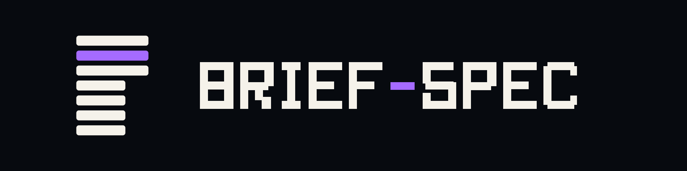
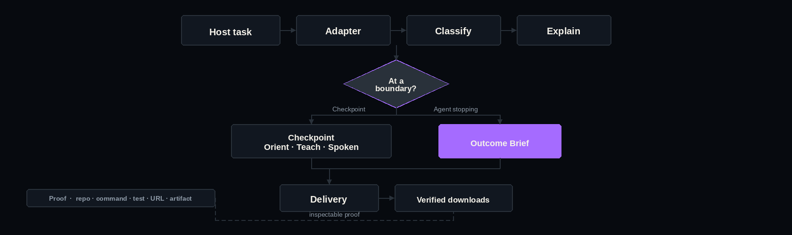
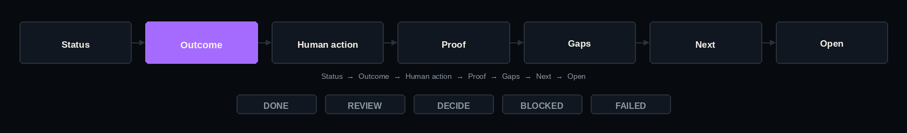

# Brief-Spec

<p align="center">
  
</p>

<p align="center"><strong>Different agents in. One predictable human handoff out.</strong></p>

Brief-Spec is a type-aware, evidence-backed delivery contract for AI coding harnesses. Same fields, same order, preserved evidence. It does not make every answer shorter; it makes every important answer legible. Brief-Spec standardizes the explanation and handoff, not the agent's reasoning. It never calls a model.

<p align="center">
  <a href="https://www.python.org/"></a>
  <a href="https://github.com/luanmorenommaciel/brief-spec/releases/tag/v0.2.0"></a>
  <a href="docs/verification.md"></a>
  <a href="LICENSE"></a>
</p>

**Public release v0.2.0** · Source candidate 0.5.0 · Not on PyPI

- Public release: `v0.2.0` on GitHub.
- Source candidate: `v0.5.0` in this checkout. Locally verified is not hosted or published.

[The problem](#the-problem) · [How it works](#how-it-works) · [Outcome Brief](#outcome-brief) · [Docs](#documentation) · [Skills](#why-the-skills-exist) · [Harness](#harness-support) · [CLI](#cli) · [Install](#install)

---

## The problem

Good agent output can still be exhausting to consume.

Once several agents are running, generation is no longer the only bottleneck. Re-entry becomes the bottleneck. One response begins with a narrative. Another hides the decision below a test log. A third mixes completed work, caveats, and suggested work into the same paragraph.

Before acting, you must first discover how to read the answer.


Brief-Spec makes that last mile predictable. It keeps the agent's full work available while giving the human handoff a stable shape.


---

## How it works

<p align="center">
  
</p>

<details>
<summary>View diagram source</summary>



</details>

```mermaid
%%{init: {'theme': 'base', 'themeVariables': { 'primaryColor': '#111720', 'primaryTextColor': '#F5F2EA', 'primaryBorderColor': '#A56BFF', 'lineColor': '#29313A', 'secondaryColor': '#070A0F', 'tertiaryColor': '#29313A', 'background': '#070A0F', 'mainBkg': '#111720', 'nodeBorder': '#A56BFF', 'clusterBkg': '#111720', 'titleColor': '#F5F2EA', 'edgeLabelBackground': '#111720'}}}%%
flowchart LR
    A["Host task"] --> B["Harness adapter"]
    B --> C["Local type classification"]
    C --> D["Type-specific explanation"]
    D --> E{"Eligible and at a boundary?"}
    E -->|"Checkpoint"| F["Orient, Teach, or Spoken Brief"]
    E -->|"Agent stopping"| G["Outcome Brief"]
    F --> H["Canonical delivery object"]
    G --> H
    H --> I["Verified downloads"]
    J["Repository, command, test, URL, or artifact"] -. "inspectable proof" .-> I

    style A fill:#111720,stroke:#29313A,color:#F5F2EA
    style B fill:#111720,stroke:#29313A,color:#F5F2EA
    style C fill:#111720,stroke:#29313A,color:#F5F2EA
    style D fill:#111720,stroke:#29313A,color:#F5F2EA
    style E fill:#29313A,stroke:#A56BFF,color:#F5F2EA
    style F fill:#111720,stroke:#29313A,color:#F5F2EA
    style G fill:#A56BFF,stroke:#A56BFF,color:#F5F2EA
    style H fill:#111720,stroke:#A56BFF,color:#F5F2EA
    style I fill:#111720,stroke:#29313A,color:#F5F2EA
    style J fill:#111720,stroke:#29313A,color:#F5F2EA
```

The host integrations normalize lifecycle events when the host provides them: session start, user prompt, completed tool use, pre-compaction, and agent stop.

Brief-Spec records bounded operational state, applies eligibility and cooldown rules, and injects guidance at the next available boundary. Hooks fail open: an internal Brief-Spec error is reported to standard error and the host receives an empty decision rather than a blocked session.

---

## Outcome Brief

A stable end-of-task contract. Seven fields, fixed order, five honest statuses.

<p align="center">
  
</p>

<details>
<summary>View diagram source</summary>


</details>

### The contract

```text
Status → Outcome → Human action → Proof → Gaps → Next → Open
```

| Status | Meaning | Constraints |
| --- | --- | --- |
| `DONE` | Requested outcome achieved and directly verified | No required action, no unresolved gaps |
| `REVIEW` | Implementation ready for human inspection | Requires human action |
| `DECIDE` | A meaningful choice is required | Requires human action and an open decision |
| `BLOCKED` | External dependency prevents continuation | Requires a gap and a next action |
| `FAILED` | The attempt did not achieve the requested outcome | Requires a gap and a next action |

### Example

```markdown
<!-- briefspec:outcome:v1 -->
## Outcome Brief

Status: REVIEW
Outcome: The Copilot plugin, project bridge, and hook adapter are implemented.
Human action: Review the generated repository files before enabling the cloud hook.

Proof:
- [direct/info] `.github/plugin/marketplace.json` — declares the Copilot plugin source
- [direct/pass] `brief-spec doctor copilot --scope project --probe` → synthetic hook passed

Gaps:
- An authenticated Copilot cloud run has not been observed in this environment.

Next:
- Run the cloud acceptance scenario and retain its run URL.

Open:
- Whether cloud checkpoints should persist beyond the job.
<!-- /briefspec -->
```

Proof items are prefixed `[direct|derived|reported]/[pass|fail|info]`. See [`schemas/`](schemas/) for the machine-readable contracts.

---

## Documentation

| Topic | Link |
| --- | --- |
| Changelog | [CHANGELOG.md](CHANGELOG.md) |
| Skills reference | [docs/skills.md](docs/skills.md) |
| Installation | [docs/installation.md](docs/installation.md) |
| Configuration | [docs/configuration.md](docs/configuration.md) |
| Architecture | [docs/architecture.md](docs/architecture.md) |
| Behavior examples | [docs/examples.md](docs/examples.md) |
| Human Continuity | [docs/human-continuity.md](docs/human-continuity.md) |
| Repository layout | [docs/repository-layout.md](docs/repository-layout.md) |
| Verified delivery | [docs/delivery.md](docs/delivery.md) |
| Compatibility | [docs/compatibility.md](docs/compatibility.md) |
| Verification record | [docs/verification.md](docs/verification.md) |
| Design theory | [docs/theory.md](docs/theory.md) |
| Brand assets | [assets/ASSETS.md](assets/ASSETS.md) |
| Contributing | [CONTRIBUTING.md](CONTRIBUTING.md) |
| Security | [SECURITY.md](SECURITY.md) |

---

## Why the skills exist

The CLI validates. The skills are how a chat agent finds the contract.

<table>
<thead>
<tr>
<th>Skill</th>
<th>Why it exists</th>
<th>When / not</th>
<th>Gate</th>
<th>Optional?</th>
</tr>
</thead>
<tbody>
<tr>
<td><code>brief-spec</code></td>
<td>Classify substantive work and shape the full explanation for the selected profile</td>
<td>
<strong>When</strong> a task begins or clearly pivots; when the user asks Brief-Spec to explain work; or when a lifecycle hook supplies a type decision.<br>
<strong>Not</strong> sending task text to another model or network; inventing Grok classification metadata.
</td>
<td><code>brief-spec classify</code></td>
<td>No</td>
</tr>
<tr>
<td><code>outcome-brief</code></td>
<td>Close substantive work with a consistently ordered, evidence-backed handoff</td>
<td>
<strong>When</strong> a task reaches a terminal outcome; when the user asks what shipped, what changed, what needs attention, or what happens next; or when a host hook requests a valid outcome.<br>
<strong>Not</strong> turning formatting into proof; claiming DONE with required action or unresolved gaps.
</td>
<td><code>brief-spec validate outcome</code></td>
<td>No</td>
</tr>
<tr>
<td><code>session-checkpoint</code></td>
<td>Re-orient a long, dense, or interruption-prone session without replacing the underlying evidence</td>
<td>
<strong>When</strong> the user asks for a recap, orientation, teaching explanation, or spoken summary; many turns or tool calls; before compaction; or a hook says a checkpoint is eligible.<br>
<strong>Not</strong> treating spoken mode as audio generation; claiming the checkpoint is canonical project memory; silently ingesting into Nexo or Obsidian.
</td>
<td><code>brief-spec validate checkpoint</code></td>
<td>No</td>
</tr>
</tbody>
</table>

### Eight work types

Each type has an ordered explanation profile loaded by the `brief-spec` router.

| Type | Explanation order |
| --- | --- |
| `general` | Answer, rationale, next action |
| `exploration` | Question, system map, entry points, flow, unknowns, next probe |
| `review` | Scope, verdict, findings, risk, validation, recommendation |
| `implementation` | Intent, changes, resulting behavior, verification, tradeoffs |
| `debugging` | Symptom, root cause, fix, regression protection, residual risk |
| `planning` | Goal, decisions, approach, sequence, gates |
| `research` | Question, synthesis, evidence quality, limitations, recommendation |
| `operations` | Event, impact, current state, actions, recovery, follow-up |

### Four reading experiences

| Experience | Purpose |
| --- | --- |
| **Outcome** | Terminal handoff: what is true, what requires the human, what proves the claim |
| **Orient** | 30–45 second operational scan: where we are, what changed, next move |
| **Teach** | Plain-language mental model: what we did, why it works, example, watch-outs |
| **Spoken** | 80–240 word sequential script designed to be heard |

---

## Harness support

`brief-spec setup` installs skills and lifecycle hooks for each harness. Project destinations vary by host.

| Harness | Status | Command | Project destination |
| --- | --- | --- | --- |
| Codex | Required | `brief-spec setup codex` | `.codex/`, `.agents/skills/` |
| Claude Code | Required | `brief-spec setup claude` | `.claude/skills/` |
| OMP | Required | `brief-spec setup omp` | `.agents/skills/` |
| Grok Build | Required | `brief-spec setup grok` | `.grok/skills/` |
| Kimi Code | Required | `brief-spec setup kimi` | `.agents/skills/` |
| Copilot | Experimental | `brief-spec setup copilot --scope project` | `.agents/skills/`, `.github/` |
| Cursor Agent | Experimental | — | Unpublished |
| Goose | Experimental | — | `.agents/skills/` |

The five required harnesses retain their full v0.5.0 live baseline. Cursor Agent and Goose are experimental; Cursor paths are implemented but unpublished.

Project-scoped Copilot installation also creates the network-free bridge used by Copilot cloud coding agents:

```text
.agents/skills/{brief-spec,outcome-brief,session-checkpoint}/
.github/brief-spec/brief-spec.pyz
.github/hooks/brief-spec.json
.github/instructions/brief-spec.instructions.md
```

The installer merges lifecycle hooks instead of replacing the host file, refuses to overwrite foreign skill files, restores prior files if installation fails, and records what it owns.

A `.claude-plugin/` directory is present in this repository for local plugin development.

---

## CLI

### First journey

```bash
# Install the public release
uv tool install git+https://github.com/luanmorenommaciel/brief-spec.git@v0.2.0

# Verify the installation
brief-spec --version

# See the eight work types
brief-spec types

# Classify bounded task text (no network)
echo "Review the authentication module" | brief-spec classify - --json

# Validate an Outcome Brief
brief-spec validate outcome path/to/handoff.md

# Validate a Checkpoint
brief-spec validate checkpoint path/to/checkpoint.md --mode spoken

# Install harness integrations
brief-spec setup codex
brief-spec setup all --scope user --require codex,claude,omp,grok,kimi

# Check installation health
brief-spec doctor all --scope user --probe --all-scopes
```

### Export and verify

```bash
# Export to multiple formats
brief-spec export handoff.md \
  --formats markdown,json,html \
  --output-dir delivery/

# Bundle with manifest
brief-spec bundle handoff.md --output handoff.zip

# Verify the bundle
brief-spec verify handoff.zip --level rendered --offline --no-plugins

# Deliver with receipt
brief-spec deliver handoff.zip --to /path/to/deliveries/
brief-spec verify /path/to/deliveries/handoff.zip.receipt.json --level delivered
```

Verification levels are cumulative: `structural` → `resolved` → `rendered` → `delivered`. See [docs/delivery.md](docs/delivery.md) for the complete export and verification reference.

### Configuration

Create user or project configuration:

```bash
brief-spec config init
brief-spec config show
brief-spec config init --scope project --project /path/to/repository
```

Project values override user values. See [docs/configuration.md](docs/configuration.md) for policy options.

---

## Install

Brief-Spec requires **Python 3.11+**. The canonical distribution is not yet on PyPI.

### Public release (v0.2.0)

```bash
uv tool install git+https://github.com/luanmorenommaciel/brief-spec.git@v0.2.0
```

### Dogfood from checkout (0.5.0)

```bash
uv tool install --force --reinstall \
  --with ./packages/brief-spec-renderer-pdf \
  --with ./packages/brief-spec-renderer-audio \
  .
brief-spec setup all --scope user --require codex,claude,omp,grok,kimi
brief-spec doctor all --scope user --probe --all-scopes
```

Project-scoped installation keeps the integration inside one repository:

```bash
brief-spec setup all --scope project --project /path/to/repository
brief-spec doctor all --scope project --project /path/to/repository --probe
```

The tagged URL installs a versioned release instead of whatever happens to be on `main`.

---

## Who this is for

Brief-Spec is for engineers and teams running multiple AI coding agents who want a predictable handoff without rebuilding their workflow.

### Who this is not for

- If you want a second brain or knowledge graph, Brief-Spec is not that. Use Nexo, Obsidian, or your preferred knowledge system.
- If you want an agent orchestrator, Brief-Spec is not that. It is the human handoff, not the task executor.
- If you want to replace Git, CI, or your issue tracker, Brief-Spec is not that. Original evidence remains authoritative.

Brief-Spec is a presentation layer. The original repository, command output, document, or host transcript remains the source of truth.

---

## Safety invariants

Brief-Spec compresses presentation, not provenance.

- A brief is never more authoritative than its source.
- A passing syntax check does not prove a live integration.
- A local commit does not prove publication.
- Planned work is not completed work.
- Direct, derived, and reported evidence must remain distinguishable.
- Unknown or unverified state is a gap, not a reason to infer success.
- Hooks fail open on internal errors.
- Installation refuses destructive overwrite of foreign files.
- Nothing is silently ingested into Nexo, Obsidian, or another knowledge system.

The JSON schemas in [`schemas/`](schemas/) define the portable data contracts.

## Honest limits

- A consistent format cannot make an unsupported claim true.
- A checkpoint cannot recover evidence the host never exposed.
- Lifecycle automation depends on the events supported by each host version.
- Spoken Brief is text until a separate text-to-speech system renders it.
- Automatic checkpoint thresholds are heuristics and remain configurable.
- Brief-Spec reduces reading friction; high-risk changes still deserve direct inspection.

---

## Experimental: Human Continuity

The source tree contains an optional, independently versioned Chronicle extension. It does not change the frozen Outcome Brief or Session Checkpoint `1.0` contracts and is not part of the public v0.2.0 or source candidate 0.5.0 publication claims.

Chronicle is never activated globally. It records what Brief-Spec observed; it does not replace Seamwise intent, Task-Spec acceptance, Converge authorization, Git evidence, or reviewed durable knowledge.

Read the complete [Human Continuity architecture](docs/human-continuity.md).

---

## Release truth

| Version | State | Notes |
| --- | --- | --- |
| v0.2.0 | Published GitHub release | Latest public release |
| 0.5.0 | Source candidate | Locally verified; awaits live/hosted/publication gates |
| 0.3.0, 0.4.0 | Unpublished | Folded into 0.5.0 |

"Locally verified" does not mean hosted or published. See the full [changelog](CHANGELOG.md) and [verification record](docs/verification.md).

---

## Repository map

```text
skills/
  brief-spec/            Type router and eight compact profiles
  outcome-brief/         Stable terminal handoff
  session-checkpoint/    Orient, Teach, and Spoken Brief
src/brief_spec/          Canonical Python import
src/briefspec/
  adapters/              Host payload normalization
  delivery.py            Canonical envelope and core renderers
  verification.py        Structural through delivered verification
  hooks.py               Safe-boundary and one-repair control
  installers.py          Transactional user/project integration
packages/
  brief-spec-renderer-pdf/    Optional HTML-to-PDF renderer
  brief-spec-renderer-audio/  Optional script-to-MP3 renderer
  brief-spec-chronicle/       Optional project continuity extension
schemas/                 Portable machine-readable contracts
docs/                    Theory, architecture, examples, installation
```

See [docs/repository-layout.md](docs/repository-layout.md) for the complete ownership map.

---

## Contributing

See [CONTRIBUTING.md](CONTRIBUTING.md) for development setup and quality gates.

```bash
git clone https://github.com/luanmorenommaciel/brief-spec.git
cd brief-spec
uv sync --group dev
uv run ruff check .
uv run ruff format --check .
uv run pytest --cov=briefspec --cov-report=term-missing
```

---

## Uninstall

```bash
# Preview removal
brief-spec uninstall all --dry-run

# Remove user installation
brief-spec uninstall all

# Remove one project installation
brief-spec uninstall copilot --scope project --project /path/to/repository
```

Brief-Spec removes receipt-owned files only when their content still matches the installed hash.

---

## License

[MIT](LICENSE)
