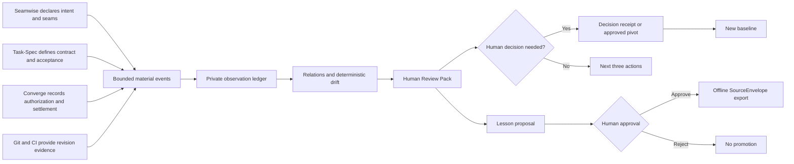

# Brief-Spec behavior and examples

This catalog shows how the current source candidate behaves across work types,
reading experiences, methods, time horizons, delivery formats, evidence states,
and harnesses. The examples are illustrative contracts; they are not claims
that the described work actually occurred.

## The four independent choices

Brief-Spec does not force every interaction into one template. It selects four
orthogonal dimensions and keeps each one visible:

| Dimension | Question it answers | Examples |
| --- | --- | --- |
| Work type | What kind of thinking is this? | `review`, `debugging`, `planning` |
| Subject | What is the work about? | `pull-request`, `bug`, `release` |
| Method context | Which process vocabulary should explain it? | `seamwise`, `task-spec`, `converge`, `general` |
| Presentation/horizon | What does the human need now? | Human Frame, Orient, Teach, Spoken, Outcome, Chronicle |

For example, one task can remain
`implementation + feature + converge` while moving from a message-level Human
Frame to a Teach checkpoint, then a terminal Outcome Brief, and later into a
Project Chronicle report.

## Eight work types

Classification is local and deterministic. Precedence is explicit override,
host-native context, bounded intent rules, then `general`. The decision stores
the type, subject, confidence, origin, and rule identifiers—not the input text.

| Prompt | Classification | Response order |
| --- | --- | --- |
| “What does this configuration flag do?” | `general + general` | Answer → Rationale → Next action |
| “Explore this repository and show me how requests reach the database.” | `exploration + codebase` | Question → System map → Entry points → Flow → Unknowns → Next probe |
| “Review PR 142 for correctness and risk.” | `review + pull-request` | Scope → Verdict → Findings → Risk → Validation → Recommendation |
| “Add idempotent retry handling to the importer.” | `implementation + feature` | Intent → Changes → Resulting behavior → Verification → Tradeoffs |
| “Why does this test fail only on Windows?” | `debugging + test` | Symptom → Root cause → Fix → Regression protection → Residual risk |
| “Plan the 0.6 release with gates and rollback.” | `planning + release` | Goal → Decisions → Approach → Sequence → Gates |
| “Research current agent hook models and recommend an approach.” | `research + architecture` | Question → Synthesis → Evidence quality → Limitations → Recommendation |
| “The deployment is degraded; assess impact and recovery.” | `operations + incident` | Event → Impact → Current state → Actions → Recovery → Follow-up |

The built-in subject vocabulary is `pull-request`, `codebase`, `change-set`,
`issue`, `bug`, `feature`, `refactor`, `test`, `release`, `architecture`,
`document`, `data`, `incident`, `dependency`, `security`, and `general`.
Subjects remain open normalized slugs, so an explicit `--subject migration-plan`
is valid even though it is not built in.

Inspect or override classification without retaining the input:

```bash
printf '%s' 'Review PR 142 for authorization gaps' \
  | brief-spec classify - --json

printf '%s' 'Look through these changes' \
  | brief-spec classify - --type review --subject pull-request --json

brief-spec types list --json
brief-spec types show debugging --json
```

Ambiguous mixed intent falls back to `general`. An inferred decision is never
promoted to high confidence. A type stays sticky within one task until the
user explicitly overrides it, starts a new task/session, or clearly declares a
pivot.

## Message: the Human Frame

The Human Frame is ephemeral response shaping, not a new stored brief. On each
substantive message, the adapter can add the minimum context needed to read the
answer in the selected method. Greetings, trivial rewrites, and short factual
questions are left alone unless Brief-Spec is explicitly requested.

### General implementation message

**User:** “Add validation for duplicate output formats.”

**Brief-Spec behavior:** Explain the intent, exact changes, resulting failure
mode, tests, and tradeoffs. Do not emit an Outcome Brief until the task reaches
its terminal boundary.

### Seamwise exploration message

**User:** “In Seamwise, where does this capability split into executable
seams?”

**Human Frame:**

- Intent: identify the human outcome before discussing files.
- System map: show capability legs and their relationships.
- Current phase: state whether work is discovery, decomposition, or tasking.
- Change: distinguish an observed seam from a proposed seam.
- Next action: identify the next probe or human choice.

### Task-Spec planning message

**User:** “Walk me through this Task-Spec packet in simple language.”

**Human Frame:**

- Intent: what the packet is trying to make true.
- Task contract: scope, constraints, allowed paths, and acceptance criteria.
- Current phase: where execution or review stands.
- Evidence: what is observed versus merely declared.
- Acceptance: the exact exit condition and who owns the decision.

### Converge operations message

**User:** “Converge stopped before settlement. What is going on?”

**Human Frame:**

- Intent: the authorized outcome.
- Authorization: what was permitted and by which reference.
- Execution: what actually ran.
- Evidence: inspectable results and missing proof.
- Settlement: why the run has or has not safely closed.

Method context never changes authority. Seamwise remains the intent and task
graph source, Task-Spec remains the bounded task/acceptance source, Converge
remains the authorization/execution/settlement source, and Git/CI remain the
revision and validation sources.

## Session: Orient, Teach, and Spoken

All three checkpoints project the same bounded session state for different
human needs.

### Orient

**Ask:** “Brief-Spec, orient me.”

```markdown
<!-- briefspec:checkpoint:v1 mode=orient -->
## Session Checkpoint — Orient

Headline: Renderer source folders now match their canonical distributions.
Current state: Documentation reconciliation is in progress.
Completed:
- PDF and audio package directories were renamed without changing compatibility imports.
Decisions:
- Retain `src/briefspec` and legacy renderer module names through `0.x`.
Proof:
- [direct/info kind=file] `docs/repository-layout.md` — records the ownership map
Next:
- Run release verification and clean-room builds.
Open:
- Hosted publication remains account-owned and unverified.
<!-- /briefspec -->
```

Use Orient when the question is “Where are we, and what happens next?”

### Teach

**Ask:** “Explain what we just changed like I am new to the project.”

```markdown
<!-- briefspec:checkpoint:v1 mode=teach -->
## Session Checkpoint — Teach

Headline: The folder name and package name now tell the same story.
Mental model: Think of each optional renderer as a labeled tool drawer.
Why it matters: A maintainer can find the source without translating between old and new brands.
What changed: The drawers are named `brief-spec-renderer-pdf` and `brief-spec-renderer-audio`.
Example: The PDF distribution and its directory now share exactly the same name.
Watch-outs:
- The internal legacy Python module remains intentionally available for compatibility.
Next:
- Let the release verifier reject any future directory drift.
Proof:
- [direct/info kind=file] `scripts/verify-release.py` — enforces the canonical layout
<!-- /briefspec -->
```

Use Teach when the human needs a mental model, a plain-language explanation,
an example, and watch-outs—not just status.

### Spoken

**Ask:** “Give me a spoken checkpoint for my walk.”

```markdown
<!-- briefspec:checkpoint:v1 mode=spoken -->
## Session Checkpoint — Spoken Brief

Script: Brief-Spec is currently reconciling its repository structure and documentation. The optional PDF and audio source folders now use the canonical hyphenated product name, while legacy Python imports remain available for compatibility. The next step is to run the complete release verification and then install the exact local candidate into every detected harness. Publication is still a separate hosted gate.

Screen-only:
- Evidence paths and hashes remain visible here rather than being read aloud.
<!-- /briefspec -->
```

Only the bounded `Script` may feed speech or audio. Proof locators, private
paths, and screen-only content never leak into narration. Spoken text and SSML
are invalid for non-Spoken briefs.

## Task: five honest Outcome states

Every substantive terminal handoff uses the unchanged Outcome Brief `1.0`
order: Status → Outcome → Human action → Proof → Gaps → Next → Open.

| Status | When it applies | Example closing signal |
| --- | --- | --- |
| `DONE` | Requested outcome is complete and no user action or known gap remains | “Implemented and all required gates pass.” |
| `REVIEW` | Work is complete enough for inspection but human review remains | “The PR review is ready; inspect two high-risk findings.” |
| `DECIDE` | Progress requires a named human choice | “Choose A or B; both consequences are stated.” |
| `BLOCKED` | An external condition prevents safe progress | “Credentials or account authorization are required.” |
| `FAILED` | The attempted outcome did not succeed | “Migration failed; rollback succeeded and evidence is retained.” |

Example terminal review:

```markdown
<!-- brief-spec:typed:v1 type=review subject=pull-request confidence=high origin=host classified_at=2026-08-15T12:00:00Z profile=1.0 -->
## Scope
PR 142 authentication changes and their tests.

## Verdict
Request changes before merge.

## Findings
The refresh-token branch accepts an expired audience claim.

## Risk
A reused token could cross the intended service boundary.

## Validation
The targeted unit test passes, but no negative audience test exists.

## Recommendation
Reject mismatched audiences and add the missing regression case.

<!-- briefspec:outcome:v1 -->
## Outcome Brief

Status: REVIEW
Outcome: The review identified one merge-blocking authentication flaw.
Human action: Review the finding and request the proposed regression test.
Proof:
- [direct/info kind=file] `src/auth/tokens.py` — audience branch inspected
- [direct/pass kind=test] `tests/test_tokens.py` — existing targeted tests passed
Gaps:
- No negative audience regression exists yet.
Next:
- Add the regression test and rerun the authentication suite.
Open:
- Whether service-specific audiences should be configured centrally.
<!-- /briefspec -->
<!-- /brief-spec -->
```

The outer typed region adds the explanation profile. The inner Outcome block
stays compatible with legacy parsers.

## Project, decision, and learning horizons

Chronicle is an optional experimental extension. Installing it does not capture
anything. A project must be explicitly initialized, and initialization writes
only to private Brief-Spec state.

| Horizon | Human question | Surface |
| --- | --- | --- |
| Project | “What happened across tasks and sessions?” | Project Chronicle / Human Review Pack |
| Decision | “What choice is needed, why, and what follows?” | Decision record and receipt |
| Learning | “What reusable lesson is worth proposing?” | Human-reviewed offline lesson proposal |

### Project Chronicle example

```bash
brief-spec-chronicle init --project /path/to/project --name seamwise-journey
brief-spec-chronicle ingest intent.json --project /path/to/project --source seamwise
brief-spec-chronicle ingest task.json --project /path/to/project --source task-spec
brief-spec-chronicle ingest settlement.json --project /path/to/project --source converge
brief-spec-chronicle status --project /path/to/project --json
brief-spec-chronicle snapshot --project /path/to/project \
  --output /tmp/chronicle.json --created-at 2026-08-15T12:00:00Z
brief-spec-chronicle export /tmp/chronicle.json \
  --formats markdown,json,html,zip,spoken-text,pdf,audio \
  --output-dir /tmp/review-pack
brief-spec-chronicle verify /tmp/review-pack \
  --level rendered --workspace /path/to/project --offline
```

The Human Review Pack always orders:

1. Intent in plain language.
2. Current phase and overall state.
3. Material changes since the prior snapshot.
4. Completed work with evidence.
5. Detours and drift.
6. Decisions already made.
7. Decisions requiring human input.
8. Risks, blockers, and unresolved evidence.
9. Lessons and recurring patterns.
10. Next three actions.
11. Evidence and provenance appendix.

### Detour, drift, pivot, blocker, discovery, and lesson

| Signal | Meaning | Brief-Spec behavior |
| --- | --- | --- |
| Detour | Explained route change that preserves intent | Record the reason and keep it distinct from drift |
| Drift | Unacknowledged divergence from an accepted baseline | Flag deterministically with source event IDs and a rule ID |
| Pivot | Human-approved intent revision | Record the decision receipt and establish a new baseline |
| Blocker | Condition preventing safe progress | Show the required human action and later resolution event |
| Discovery | New fact that changes understanding | Update the report without pretending it was always known |
| Lesson proposal | Potentially reusable insight awaiting review | Keep it proposed until explicit approval or rejection |



Record a decision and review lessons explicitly:

```bash
brief-spec-chronicle decision record decision.json --project /path/to/project
brief-spec-chronicle lessons list --project /path/to/project --json
brief-spec-chronicle lessons approve LESSON_ID --project /path/to/project \
  --output /tmp/lesson-source-envelope.json --owner human
brief-spec-chronicle lessons reject LESSON_ID --project /path/to/project \
  --reason 'Too project-specific' --owner human
```

Approval creates only an offline proposal and receipt. It cannot change Nexo,
Task-Spec, Seamwise, Converge, a skill, policy, prompt, test, or canonical
knowledge.

## Evidence behavior

| Input state | Result |
| --- | --- |
| `[direct/pass kind=test]` with an inspectable test record | Preserved as direct passing evidence |
| Derived synthesis linked to sources | Preserved as derived, never upgraded to direct |
| Provider report from Exa, Tavily, Firecrawl, or RAFT | Normalized as provider-neutral provenance |
| Local file inside `--workspace` | Resolved and hashed when requested |
| File outside the workspace or symlink escape | Rejected unless the explicit outside-workspace option is used |
| Public URL with network consent | Checked with bounded, SSRF-safe requests |
| Private, loopback, metadata, or link-local URL | Never contacted by the public resolver |
| Offline network locator | Reported unresolved, not failed into invented evidence |
| Expired artifact | Remains visible and classified as expired |
| Missing event or evidence | Rendered as unavailable, never “nothing happened” |
| Legacy command-like backticks | Retained as a warning/observation and never executed |

The source may say `local`, `private`, or `public`; that label does not override
network safety. Proof status, access, provenance, hash, observation time, and
expiry remain separate fields.

## Downloads and verification

| Format | Behavior |
| --- | --- |
| Markdown | Standalone human-readable bounded contract |
| JSON | Canonical machine-readable object |
| HTML | Self-contained, accessible, printable, CSP-restricted, zero remote assets |
| ZIP | Deterministic members plus ordered `manifest.json` |
| Spoken text / SSML | Spoken Checkpoint script only |
| PDF | Exact offline HTML rendered by optional Chromium package |
| Audio | Canonical spoken script rendered locally or with explicit network consent |
| Chronicle video | Experimental offline storyboard, captions, transcript, chapters, and MP4 |
| Receipt | External attestation of destination bytes; never self-referential inside ZIP |

```bash
brief-spec validate auto handoff.md --strict --json
brief-spec export handoff.md --formats markdown,json,html --output-dir delivery
brief-spec bundle handoff.md --formats markdown,json,html --output delivery.zip
brief-spec verify delivery.zip --level structural --offline --no-plugins
brief-spec verify delivery.zip --level rendered --offline --allow-plugins
brief-spec deliver delivery.zip --to /explicit/local/destination
brief-spec verify /explicit/local/destination/delivery.zip.receipt.json \
  --level delivered --offline
```

Verification levels are cumulative: `structural` validates shape,
`resolved` checks permitted evidence locators, `rendered` checks format
semantics and hashes, and `delivered` checks the external receipt and
destination bytes. Network and renderer plugin loading are both opt-in.

## Harness behavior

| Harness | Current tier | What the human sees |
| --- | --- | --- |
| Codex | Verified | Router skill and lifecycle policy with Outcome, Orient, Teach, and Spoken boundaries |
| Claude Code | Verified | Shared skills and native settings hooks |
| OMP | Verified | Native skills plus managed extension lifecycle events |
| Grok Build | Verified | Native skills/hooks and one bounded terminal repair when required |
| Kimi Code | Verified | User plugin with lifecycle hooks; project scope is skills-only without that plugin |
| GitHub Copilot CLI | Experimental | Portable assets and fixture-tested lifecycle policy |
| Cursor Agent | Experimental | Skill and fixture-tested hooks, host-dependent final capture |
| Goose | Experimental | Skill surface with manual terminal boundary |

```bash
brief-spec capabilities all --json
brief-spec setup all --scope user --require codex,claude,omp,grok,kimi
brief-spec doctor all --scope user --probe --all-scopes
```

`setup all` installs detected harnesses only. A named `--require` absence fails
the transaction. All-host setup snapshots every owned path and rolls every
host back if one write fails. Doctor’s synthetic probe proves the installed
adapter can process a representative event; it does not claim that an external
authenticated service ran a live task.

## Full command surface

Core user commands:

```text
brief-spec setup|install|uninstall
brief-spec doctor
brief-spec capabilities
brief-spec types list|show
brief-spec classify
brief-spec validate
brief-spec export
brief-spec bundle
brief-spec verify
brief-spec deliver
brief-spec config init|show
brief-spec state list|prune|reset
```

Chronicle commands:

```text
brief-spec-chronicle init
brief-spec-chronicle ingest
brief-spec-chronicle status
brief-spec-chronicle snapshot
brief-spec-chronicle export
brief-spec-chronicle verify
brief-spec-chronicle decision record
brief-spec-chronicle lessons list|approve|reject
brief-spec-chronicle archive
brief-spec-chronicle restore
brief-spec-chronicle delete
brief-spec-chronicle doctor
```

Archive is deterministic and non-destructive. Restore validates members,
hashes, schemas, and the complete chain before replacing Chronicle-owned state.
Delete requires the exact project ID twice and removes only that project’s
Chronicle directory.

## What Brief-Spec does not do

- It does not replace the agent’s reasoning or make unsupported claims true.
- It does not emit a full brief after every message.
- It does not store raw prompts, transcripts, tool output, credentials,
  authentication state, or resume tokens in Chronicle.
- It does not execute command-like evidence.
- It does not turn a model into a harness or blur harness and model metadata.
- It does not make its ledger the canonical project truth.
- It does not silently send email, chat messages, cloud speech, or video.
- It does not silently promote lessons or modify another method or knowledge
  system.
- It does not activate Chronicle because the package was installed globally.
- It does not describe local, synthetic, or fixture evidence as a published or
  authenticated-host result.
