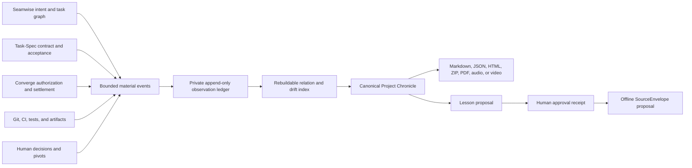

# Human Continuity Fabric and Project Chronicle

Status: experimental source implementation. `brief-spec-chronicle` is not part of the frozen
`0.5.0` public-release gate and has not been published.

## Purpose

Brief-Spec now distinguishes six time horizons without changing the Outcome Brief or Session
Checkpoint `1.0` contracts:

| Horizon | Surface | Persistence |
| --- | --- | --- |
| Message | Method-aware Human Frame | Ephemeral |
| Session | Orient, Teach, or Spoken Checkpoint | Existing bounded state |
| Task | Outcome Brief | Existing delivery object |
| Project | Project Chronicle | Explicitly initialized private ledger |
| Decision | Human Review Pack and decision receipt | Explicit human record |
| Learning | Reviewed lesson proposal | Offline export after human approval |

The guiding rule is **constant awareness, not constant interruption**. Routine activity is not
Chronicle material. Intent, phase, evidence, acceptance, drift, blockers, decisions, artifacts, and
reviewed lessons are material.

## Authority boundary



Seamwise remains authoritative for intent decomposition, Task-Spec for the bounded task and
acceptance, Converge for authorization/execution/settlement, and Git or CI for revisions and tests.
The Chronicle ledger proves only what Brief-Spec observed. Its hash chain is tamper evidence, not
source identity or independent acceptance.

The SQLite index is derived and disposable. All relationships retain source event IDs, a rule ID,
evidence basis, confidence, and review state. No relation silently becomes canonical knowledge.

## Explicit activation and state

Install the optional source package into the Brief-Spec tool environment, then initialize one
project deliberately:

```bash
uv tool install --force --reinstall \
  --with ./packages/brief-spec-renderer-pdf \
  --with ./packages/brief-spec-renderer-audio \
  --with ./packages/brief-spec-chronicle \
  --with ./packages/brief-spec-renderer-video \
  --with-executables-from brief-spec-chronicle \
  .
brief-spec-chronicle init --project .
```

The install is one managed-environment transaction; list every optional package that should remain
available. It installs the Chronicle executable but still does not activate capture for any project.

Initialization does not modify the repository. State lives under:

```text
$BRIEF_SPEC_HOME/chronicles/<project-id>/
  project.json
  events/YYYY-MM.ndjson
  index.sqlite3
  receipts/
```

Directories use private permissions where supported. Events are limited to 64 KiB. Raw prompts,
transcripts, tool output, credentials, authentication state, and resume tokens are rejected before
they can enter the ledger. Metadata remains for the project lifetime until explicit deletion.

## Material event contract

`brief-spec-event/1.0` carries one stable event kind plus the provider-native kind in source
metadata. Event identity excludes observation time and chain position, so retries deduplicate. The
event hash includes the previous event hash, so the append order remains inspectable. Late events
are valid and reports expose their occurrence time separately from observation time.

Method context is independent of work type:

```text
work_type=implementation
subject=feature
method_context=converge
method_phase=execution
```

When a host explicitly supplies method metadata it wins. A bounded prompt mentioning exactly one
known method may infer it. Conflicting method names fall back to `general`.

## Chronicle workflow

```bash
brief-spec-chronicle ingest event.json --project . --source converge
brief-spec-chronicle status --project . --json
brief-spec-chronicle snapshot --project . --output chronicle.json
brief-spec-chronicle export chronicle.json \
  --formats markdown,json,html,zip \
  --output-dir output/chronicle
brief-spec-chronicle verify output/chronicle --level rendered --workspace . --offline
```

Snapshots record an ingest-order ledger cutoff. Supplying `--ledger-cutoff EVENT_ID` replays the
same cutoff even after later events arrive. Human chronology is still ordered by occurrence time,
and a material event observed after it occurred is visibly marked as a late arrival.

`ingest` also accepts bounded native records from Brief-Spec delivery, Seamwise, Task-Spec,
Converge, Exa, Tavily, Firecrawl, and RAFT sources. These adapters retain normalized metadata and
locators—not provider payloads or excerpts. A deliberate `correlation_id` lets two harnesses
report one transition without double counting it.

The Human Review Pack always presents intent, current state, material changes, completed work,
detours and drift, recorded decisions, requested decisions, blockers, lessons, next actions, and an
evidence appendix in that order.

PDF and audio reuse the official renderer engines. The optional video renderer creates a canonical
storyboard, offline 1600×900 scene frames, local or explicitly consented narration, H.264/AAC MP4,
WebVTT captions, transcript, chapters, hashes, and a renderer fingerprint. Video byte determinism is
claimed only for an identical Chromium/ffmpeg/font/platform fingerprint.

All outputs are rendered in a private staging directory before a rollback-capable multi-file
commit. `manifest.json` covers the rendered files. The external `chronicle-receipt.json` covers
those files, the manifest, and any ZIP. Opaque evidence identifiers stay unresolved and yield a
warning; `file:` and `commit:` locators can be resolved within `--workspace`. Public URLs are
checked only when verification is not run with `--offline`.

The evidence appendix retains `local`, `private`, or `public` access and declared expiry. Expired
evidence fails resolved verification at the snapshot's canonical creation time. Private URLs stay
visible but are never contacted by the unauthenticated resolver.

## Decisions and reviewed learning

Human decisions enter as `brief-spec-decision/1.0` records. A pivot supersedes the earlier intent
baseline; it is not left open as unexplained drift.

A lesson remains `proposed` until a recorded human choice changes it to `approved` or `rejected`.
Approval permits an offline Nexo-compatible SourceEnvelope proposal. It never writes Nexo state,
modifies a method, installs a skill, changes policy, or approves canonical knowledge.

Likewise, `INTENT_REVISED` becomes a pivot baseline only when it cites a recorded human decision.
Without that receipt it remains visible as decision drift; it cannot silently erase earlier drift.

## Failure and privacy behavior

- Chronicle is absent by default and core hooks continue normally when it is not installed.
- Rejected events are never persisted.
- Duplicate events leave the ledger unchanged.
- A broken index is rebuilt from the event segments.
- A broken hash chain blocks snapshots, archive, and repair that could hide the problem.
- Missing source events render as unavailable rather than as proof that nothing happened.
- `archive` seals a deterministic portable bundle without deleting state; `restore` validates its
  member paths, hashes, event schemas, and complete hash chain before replacing owned state.
- `delete` requires the exact project ID twice and removes only its private Chronicle directory.
- Renderers require explicit consent for cloud speech. Evidence verification contacts only public
  HTTP(S) locators and can be forced fully offline with `--offline`.

The repository includes `scripts/run-chronicle-e2e.py`, a disposable
Seamwise → Task-Spec → Converge journey covering initialization, material ingestion, resolution,
deterministic downloads, ZIP verification, archive, exact deletion, and restore.

## Falsification and promotion gates

Chronicle must remain experimental if it makes people inspect evidence less, increases false
confidence, produces noisy alerts, cannot distinguish pivots from drift, or retains sensitive
conversation data. Promotion requires paired human evidence, at least one independent emitter,
zero critical privacy violations, deterministic replay, and no regression in the core handoff
contracts.
