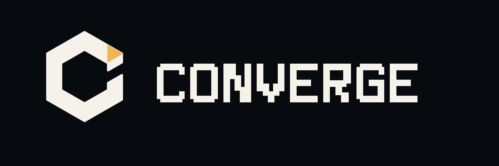
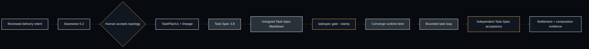
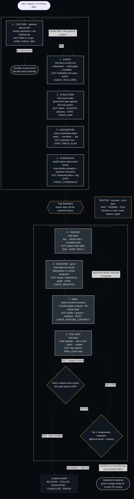

<div align="center">



# Converge

**Coordinate intent, decomposition, task authority, execution, and settlement without duplicating authority.**

[](https://github.com/luanmorenommaciel/converge/actions/workflows/ci.yml)
[](https://github.com/luanmorenommaciel/converge/releases)
[](#requirements)
[](LICENSE)

Converge 0.2.0 | cvg 0.2.0 | Seamwise 0.2.0 | Task-Spec 3.8.0

[Owns](#what-converge-owns) · [Skills](#why-the-skills-exist) · [Descent](#descent) · [Chat](#chat-experience) · [CLI](#cli) · [Install](#install) · [Docs](#documentation)

</div>

## What Converge owns

Converge is the thin coordinator and assurance layer around two independent
engines. It calls their public binaries. It does not import, vendor, or copy
their implementations.



| System | Sole authority |
|---|---|
| Seamwise | Evidence-backed seams, swimlanes, capability legs, reviewed decomposition, `TaskPlan/v1`, and lineage |
| Task-Spec | TaskPlan validation, materialization, Task-Spec structure, authorization, handoff, evals, and acceptance |
| Converge | Cross-engine sequencing, executable binding, bounded execution, settlement, and composition receipts |
| Human reviewer | Acceptance of Seamwise topology and explicit risk decisions |
| Executor | Product-code changes inside the authorized runtime contract; never self-acceptance |

Duplicate capability is tolerable. Duplicate authority is not. A Seamwise
review does not authorize task dispatch, a Task-Spec materialization receipt
does not sign a task, and model narration is never settlement evidence. The
full non-authority table is in [docs/concepts/authority.md](docs/concepts/authority.md).

## Why the skills exist

The CLI is the referee. Skills exist so a chat agent finds the next pass without reading the whole method. The installer projects **exactly eleven** Converge skills to `.agents/skills/`, `.claude/skills/`, and `.grok/skills/`. Pass 5 Tasking is standalone [`taskspec`](https://github.com/luanmorenommaciel/task-spec), not a mirrored skill.

<table>
<tr>
  <th>Pass</th>
  <th>Skill</th>
  <th>Why it exists</th>
  <th>When / not</th>
  <th>Gate</th>
</tr>
<tr>
  <td>0 · opt</td>
  <td><a href="skills/idea-to-brd/"><code>idea-to-brd</code></a></td>
  <td>Turn a raw idea into a BRD in the owner's voice, or record a no-go</td>
  <td><strong>When</strong> someone says they have an idea, capture this idea, write the brief, grill the idea, or start pass 0.<br><strong>Not</strong> when a BRD already exists (enter at Pass 1), or to write a tech-spec (that is Pass 1).</td>
  <td><code>CHECK_BRD</code></td>
</tr>
<tr>
  <td>1</td>
  <td><a href="skills/brd-docs-to-tech-req/"><code>brd-docs-to-tech-req</code></a></td>
  <td>Transform a client BRD into a verifiable tech-spec with falsifiable requirements</td>
  <td><strong>When</strong> a brief has landed and someone asks to turn it into a tech-spec or start pass 1.<br><strong>Not</strong> for architecture or stack decisions (Pass 3), when a signed-off tech-spec already exists (Pass 2), or when no BRD exists (Pass 0).</td>
  <td><code>CHECK_TECH_SPEC</code></td>
</tr>
<tr>
  <td>2</td>
  <td><a href="skills/tech-req-to-adrs/"><code>tech-req-to-adrs</code></a></td>
  <td>Ground the spec against the real system and record grounding decisions as ADRs</td>
  <td><strong>When</strong> the user says structure pass, write the ADRs, ground the spec against the repo, greenfield or brownfield, or start Pass 2.<br><strong>Not</strong> for solution design or "build X" (that is Pass 3).</td>
  <td><code>CHECK_ADR</code></td>
</tr>
<tr>
  <td>3</td>
  <td><a href="skills/reqs-to-swimlane-plans/"><code>reqs-to-swimlane-plans</code></a></td>
  <td>Split the system into one sketch plan per swimlane along its natural seams</td>
  <td><strong>When</strong> the user says decompose, swimlane plans, find the seams, one plan per lane, or split into legs.<br><strong>Not</strong> for atomic tasks or implementation code (Pass 5).</td>
  <td><code>CHECK_PLAN</code></td>
</tr>
<tr>
  <td>4</td>
  <td><a href="skills/sketch-plans-adversarial-review/"><code>sketch-plans-adversarial-review</code></a></td>
  <td>Run plans through a different-family model as adversary; end at THE BARRIER</td>
  <td><strong>When</strong> the user says adversarial review, consensus, attack the plans, have another model refute this, or sign off the plans.<br><strong>Not</strong> to write new plans (Pass 3) or cut tasks (Pass 5).</td>
  <td><code>CHECK_CONSENSUS</code></td>
</tr>
<tr>
  <td>5</td>
  <td>standalone <a href="https://github.com/luanmorenommaciel/task-spec"><code>taskspec</code></a></td>
  <td>Turn accepted legs into atomic, vendor-neutral units with runnable evals</td>
  <td><strong>When</strong> accepted legs must become sealed Task-Specs.<br><strong>Not</strong> a Converge skill; use the standalone taskspec CLI. Converge does not install a mirrored Task-Spec skill.</td>
  <td><code>TIER=1</code></td>
</tr>
<tr>
  <td>6 · opt</td>
  <td><a href="skills/task-specs-to-issues/"><code>task-specs-to-issues</code></a></td>
  <td>Project signed Task-Specs onto tracker issues with <code>blocked-by</code> links</td>
  <td><strong>When</strong> the user says register the tasks, push to Linear or GitHub issues, or bridge the backlog onto a tracker.<br><strong>Not</strong> for authoring tasks (Pass 5) or running them (Pass 8). Skip to keep the queue repo-local.</td>
  <td><code>CHECK_REGISTER</code></td>
</tr>
<tr>
  <td>7</td>
  <td><a href="skills/task-to-runtime-contract/"><code>task-to-runtime-contract</code></a></td>
  <td>Bind one signed Task-Spec to an enforceable runtime contract and emit task brief</td>
  <td><strong>When</strong> binding one signed Task-Spec before task-loop (Pass 7 · 7A contract + 7B brief).<br><strong>Not</strong> to author Task-Specs, select work across tasks, or execute the task.</td>
  <td><code>CHECK_RUNTIME_CONTRACT</code></td>
</tr>
<tr>
  <td>8</td>
  <td><a href="skills/task-loop/"><code>task-loop</code></a></td>
  <td>Take ONE issue, run its eval in a bounded loop until GREEN, open a PR</td>
  <td><strong>When</strong> a user or CI says run issue N, execute this task, or drive this issue to a green-eval PR.<br><strong>Not</strong> to choose or fan out across tasks (Manager).</td>
  <td><code>TASK_LOOP</code></td>
</tr>
<tr>
  <td>util</td>
  <td><a href="skills/evidence-to-next-pass/"><code>evidence-to-next-pass</code></a></td>
  <td>Derive where the descent stands from workspace evidence; hand agent the right pass prompt</td>
  <td><strong>When</strong> someone asks what's next, where we are in the descent, continue the run, start pass N, or before steering any pass.<br><strong>Not</strong> to waive a cvg gate, and not to pick the lane (<code>cvg lane</code> owns that).</td>
  <td><code>NEXT_PASS</code></td>
</tr>
<tr>
  <td>util · opt</td>
  <td><a href="skills/pass-to-lesson/"><code>pass-to-lesson</code></a></td>
  <td>After any closed pass, teach the owner what was built and why</td>
  <td><strong>When</strong> someone says teach me what was built, explain this pass, walk me through the artifacts, or debrief.<br><strong>Not</strong> to run a pass or to attack artifacts (Pass 4).</td>
  <td><code>CHECK_LESSON</code></td>
</tr>
<tr>
  <td>util</td>
  <td><a href="skills/skill-creator/"><code>skill-creator</code></a></td>
  <td>Author, evaluate, package, and structurally validate agent skills</td>
  <td><strong>When</strong> creating, editing, evaluating, or validating a skill.<br><strong>Not</strong> No do-not clause in the skill frontmatter.</td>
  <td>validated package</td>
</tr>
</table>

`cvg verify` belongs to the **Pass 8 runtime story** even though packaged under `task-to-runtime-contract`: it consumes the bound spec and diff, then asks a different-family judge to attack held-out criteria before settlement.

`cvg lane` chooses `FAST`/`NORMAL`/`FULL` and **never waives a gate**.

Deep essays on each pass stay in [skills/README.md](skills/README.md).

## Descent

The method has **two phases with one barrier between them**. Consensus (Pass 4) is the last human sign-off before the machine takes over.



**Two phases, one barrier.** Capture (Pass 0) is optional. Register (Pass 6) is opt-in. Workspace is `cvg/` first.

Full descent guide: [docs/guides/descent.md](docs/guides/descent.md).

## Chat experience

The descent conductor ([`evidence-to-next-pass`](skills/evidence-to-next-pass/)) owns the canonical pass prompts and the sequence itself. When the user asks to go step by step, `cvg next --guided` turns the same evidence-derived boundary into four choices—`CONTINUE`, `EXPLAIN`, `INSPECT`, or `PAUSE`—and waits. It creates no second loop and stores no chat state.

### The four-step chat path

1. **Session opens** → `cvg next` or opt-in `cvg next --guided` — derives where the descent stands from workspace evidence
2. **Before a pass** → `cvg next pre N` — the missing step IS the instruction (`PASS_PRE=OK` or `PASS_PRE=MISSING`)
3. **Steer with the pass prompt** — `skills/<pass-skill>/references/pass-prompt.md` (shipped, never copied into the consumer)
4. **After the pass** → `cvg next post N` then the pass's `cvg` gate

**Evidence presence is not a verdict.** `cvg next` sequences; gates decide.

### Pass prompt example (Pass 0 · Capture)

> **Mission:** turn the stakeholder's raw, incomplete idea into a Business
> Requirements Document in *their* voice. The interview is the work: grill the
> gaps out of the idea — do not politely paraphrase it.
>
> **Exit:** `cvg capture` → `CHECK_BRD=PASS`. If it fails, fix what it names and
> re-gate — never argue with the gate.

Pass 5 has no Converge pass-prompt — it uses the standalone Task-Spec CLI directly.

### Harness destinations

| Harness | dest |
|---|---|
| Codex / Kimi | `.agents/skills/` |
| Claude Code | `.claude/skills/` |
| Grok | `.grok/skills/` |

No Cursor dest exists in `install.sh`.

**Claude Code plugin.** Claude Code can also load `.claude-plugin/` (`plugin.json` + `marketplace.json`): eleven owned skills + `cvg`; Task-Spec independently installed at 3.8.

**Router scaffold.** `cvg setup harness` scaffolds `AGENTS.md` (~50 lines, routing only, non-clobbering). Bind (Pass 7B) emits `AGENTS.task.md` (identifiers, not content).

**Cockpit.** [Cockpit](apps/cockpit/) is a read-only observation and interpretation surface over `cvg snapshot`. It cannot authorize work.

```bash
npm run cockpit:install
npm run cockpit:dev --   --cvg-home "$PWD"   --project-root /absolute/path/to/project
```

Full chat guide: [docs/guides/chat.md](docs/guides/chat.md).

## CLI

### First composed journey

```bash
export CVG_TASKSPEC_BIN=/absolute/path/to/task-spec/bin/taskspec
export CVG_SEAMWISE_BIN=/absolute/path/to/seamwise/bin/seamwise

cvg compose prepare --source recipe.yaml
# COMPOSE=NEEDS_REVIEW

cvg compose review   --reviewer "repository-owner"   --reason "The seams, ownership, dependencies, and rollback paths are accepted."
# COMPOSE=PREVIEW_READY

cvg compose preview
# COMPOSE=PREVIEW_READY

cvg compose materialize
# COMPOSE=MATERIALIZED

cvg compose status
# COMPOSE=MATERIALIZED
```

The materialized leaves still contain `signed_off: false`.
Authorization remains explicit and per leaf:

```bash
taskspec gate --stamp cvg/tasks/T-20260815-health-status.md
cvg bind --task cvg/tasks/T-20260815-health-status.md
git add cvg/tasks cvg/execution
git commit -m "authorize and bind health status task"
cvg loop --issue T-20260815-health-status --agent codex
```

### Pass verbs

```bash
cvg init
cvg setup signing
cvg lane "add a health endpoint"

cvg capture
cvg intent
cvg structure
cvg decompose --source recipe.yaml
cvg compose review --reviewer owner --reason "Topology accepted"
cvg tasks plan --manifest seamwise/task-plan.json
cvg compose materialize
cvg tasks validate cvg/tasks/T-20260815-health-status.md
cvg tasks gate --stamp cvg/tasks/T-20260815-health-status.md
cvg bind --task cvg/tasks/T-20260815-health-status.md
cvg loop --issue T-20260815-health-status --agent codex
```

### Compose states

- `COMPOSE=NEEDS_REVIEW`
- `COMPOSE=PREVIEW_READY`
- `COMPOSE=MATERIALIZED`
- `COMPOSE=BLOCKED`
- `COMPOSE=ENGINE_UNAVAILABLE`

### Machine contract

Every public form accepts global `--json` and `--dry-run` in any position.

```bash
cvg --json help
cvg version --json
cvg agent-context --json
cvg compose --json status
```

`--json` emits one `ConvergeCLIResult/v1` document. The canonical 60-form matrix is [contracts/cli-command-matrix.json](contracts/cli-command-matrix.json); the human reference is [docs/reference/cli.md](docs/reference/cli.md).

Task-Spec pin remains **3.8.0**; 3.9.x writes an absolute `path:` into `_state.yaml` and is not supported.

## Install

### Requirements

- Git
- Bash 3.2 or newer
- Python 3
- Task-Spec 3.8.0 for every Converge installation
- Seamwise 0.2.0 only for decomposition and `cvg compose`
- Node 22 only for the npm door and Cockpit

Install the published stack in dependency order:

```bash
git clone --branch v3.8.0 https://github.com/luanmorenommaciel/task-spec.git
bash task-spec/install.sh --global --copy
taskspec demo

python3 -m pip install   "git+https://github.com/luanmorenommaciel/seamwise.git@v0.2.0"

git clone --branch v0.2.0   https://github.com/luanmorenommaciel/converge.git
bash converge/install.sh --target /absolute/path/to/your-project --copy
```

Converge also supports:

```bash
npm install -g github:luanmorenommaciel/converge
cvg-install
```

or:

```bash
CVG_REF=v0.2.0   bash -c "$(curl -fsSL https://raw.githubusercontent.com/luanmorenommaciel/converge/main/install.sh)"
```

The installer projects exactly eleven Converge skills to `.agents/skills/`,
`.claude/skills/`, and `.grok/skills/`. It installs no Task-Spec or Seamwise
implementation. The repository is private; all install doors require access.

## Release truth

| Claim | Current evidence |
|---|---|
| Task-Spec 3.8.0 | Published from immutable commit `0e6180cfc3009bd4ef9cf7ab050b463e10d4af91`; hosted Ubuntu/macOS release installation green |
| Seamwise 0.2.0 | Published from immutable commit `5a398169c3fefcb65eb1a47c0cb4f967dfdc0515`; exact-commit and packaged Ubuntu/macOS gates green |
| Converge 0.2.0 | Release work merged through PRs #13–#15; `v0.2.0` identifies the immutable release commit |
| Hosted CI | All eight jobs passed on exact feature SHA `1fa054546b5678838af21969816b94f8dab4ed1b` in run `32048296517` |
| Release publication | The `v0.2.0` tag workflow independently verifies Ubuntu/macOS, builds checksummed assets, and publishes the GitHub release |
| Historical Converge 0.1.0 | Published and immutable; it documents the former bundled Task-Spec architecture |

## Who this is for

**Factory compose + settlement.** Use Converge for dock, factory, and big-bang only — not the everyday consult path.

## Who this is not for

- **Everyday coordinator** — use WorkHelm for nuances, backlog, RPI
- **Manager fleet** — task scheduling across the frontier is a separate, still-future layer
- **Autonomous approval** — Converge never merges, pushes, or opens a PR on the user branch unless a human asked

## Scope of v0.2.0

This release promises a reproducible composed single-task path with strict
external-engine boundaries. It does not promise Manager fleet scheduling,
production reliability, a live tracker, or autonomous approval of human
decisions.

## Documentation

| Start here | Best for |
|---|---|
| [Knowledge base](docs/index.md) | Map and how to navigate |
| [Getting started](docs/getting-started/index.md) | Install, first composed leaf, reviewer route |
| [Descent guide](docs/guides/descent.md) | Two phases, one barrier, workspace discovery |
| [Chat guide](docs/guides/chat.md) | Four-step path, opt-in guided choices, harness dests, plugin |
| [Skills reference](docs/concepts/skills.md) | Eleven skills + standalone Tasking |
| [Authority](docs/concepts/authority.md) | Who may decide what |
| [Trust](docs/trust/index.md) | What a receipt proves and what it does not |
| [CLI reference](docs/reference/cli.md) | Generated 60-form table |
| [Contracts](contracts/README.md) | Versioned JSON schemas |
| [Skill catalog](skills/README.md) | Deep essays on each pass |
| [Cockpit](apps/cockpit/README.md) | Read-only observer |
| [Contributing](CONTRIBUTING.md) | Local bootstrap and gates |

## Repository map

| Path | Role |
|---|---|
| `bin/` | Stable CLI plus focused private helpers |
| `contracts/` | Canonical CLI matrix and versioned JSON Schemas |
| `skills/` | Exactly eleven Converge orchestration and assurance skills |
| `apps/cockpit/` | Read-only observer UI |
| `templates/` | Consumer workspace templates |
| `tests/` | Hermetic gate, install, loop, JSON, and composed-flow suites |
| `scripts/` | Docs, package, release, and evidence tooling |
| `evidence/` | Retained live-executor traces for named release gates |
| `docs/` | Knowledge base; start at [`docs/index.md`](docs/index.md) |
| `assets/` | README hero, Settlement Fold catalog, and process plates — see [ASSETS.md](assets/ASSETS.md) |

## Verification

`make bootstrap` assembles the pinned pairing under `.engines/` and `.venv/`,
after which `make check` needs no exported paths. See [CONTRIBUTING.md](CONTRIBUTING.md).

```bash
make check
make check-json
make check-docs
make check-composed
make check-live-evidence
make demo-composed
make release-check
```

A green local `make check` needs the release pairing:

- Task-Spec **3.8.0** at commit `0e6180cfc3009bd4ef9cf7ab050b463e10d4af91`
- Seamwise **0.2.0** at commit `5a398169c3fefcb65eb1a47c0cb4f967dfdc0515`

## Contributing

See [CONTRIBUTING.md](CONTRIBUTING.md).

## License

[MIT](LICENSE)
