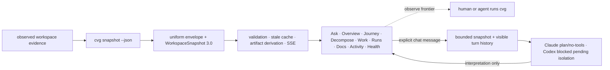

# Converge Cockpit

Cockpit is an operational projection of a real Converge workspace. It turns
the nine-pass descent, typed decomposition, gate results, work queue, execution
runs, readable documents, adversarial review, receipts, health, and CLI
authorization into one full-screen surface. The CLI and repository remain the
source of truth.

The observation surfaces never execute Converge work. They expose the current
frontier and exact pass context, but cannot create, run, approve, register,
bind, transition, or settle it. Ask Converge is a separate chat-shaped ACP
interpretation path; its answers are never promoted into repository state or
proof.

## Run against a workspace

From the Converge repository root:

```bash
npm run cockpit:install
npm run cockpit:dev -- \
  --cvg-home "$PWD" \
  --project-root /absolute/path/to/your/converge-workspace
```

Open <http://127.0.0.1:4173>. Both roots are mandatory. The bridge only binds
to loopback. Its observation path invokes exactly one read-only CLI command:
`cvg snapshot --json`.

The Codex and Claude ACP adapters are bundled and configured with the Cockpit.
Ask uses an existing provider sign-in; authentication is checked when a turn
starts. No credential value is forwarded by the Cockpit environment filter.

For the analytics-engineering proving ground used during V0:

```bash
npm run cockpit:dev -- \
  --cvg-home "$PWD" \
  --project-root ../cvg-use-cases-e2e/use-cases/uc-01-analytics-engineering
```

If the first bridge request is unavailable, the client clearly labels and
renders the deterministic replay fixture in
[`src/data/fallback.ts`](src/data/fallback.ts). A replay is never labeled live.
After a live snapshot has loaded, a transient refresh failure retains that
last-good snapshot and marks the transport stale.

## Production build

```bash
npm run cockpit:build
npm run cockpit:start -- \
  --cvg-home "$PWD" \
  --project-root /absolute/path/to/your/converge-workspace
```

The built interface is then served with its loopback-only API at
<http://127.0.0.1:4174>.

## Truth path



The JSON contract is
[`../../contracts/ui/v3/workspace-snapshot.schema.json`](../../contracts/ui/v3/workspace-snapshot.schema.json).

The observation bridge does not run gates independently, read Git state, scan
domain files, infer associations, or construct authorization. Those semantics
are emitted by the CLI, whose bounded parsers project canonical files into the
v3 snapshot. The bridge validates that contract, serves snapshot- and SHA-bound
derived previews, and streams semantic snapshot changes.

Ask sends only a bounded snapshot summary, the selected typed entity, artifact
text explicitly included in the request, and a bounded visible transcript.
Each message starts a fresh disposable ACP session; transcript continuity is
owned by Cockpit rather than implied provider-session continuity. Claude starts in an empty
temporary directory outside the workspace with no client MCP servers, must
report `plan`, and receives no built-in tools or settings sources. If that
boundary cannot be established, the turn fails before the prompt. The Codex
choice remains visible but blocked because `codex-acp@1.1.9` cannot suppress its
local read/search tools; a forged POST is rejected before process spawn.
Permission requests are always rejected. Cockpit requests provider-session
deletion when ACP advertises it and always removes its own in-memory session;
provider-side retention and account policy remain the provider's
responsibility.

The interface intentionally keeps these facts separate:

- a deterministic gate verdict;
- an adversarial review verdict and its blocking questions;
- the CLI conductor's current authorization;
- whether an artifact still matches the snapshot digest.

Artifact previews require the snapshot ID and captured SHA-256. The bridge
returns `409` if the snapshot or source bytes changed before the preview opened.
Markdown renders as safe GFM with raw HTML and remote images disabled. PDFs are
verified as complete source bytes, then converted server-side into a bounded
text-only preview; visual layout, images, attachments, and raw PDF bytes are not
sent to the browser. Files outside the allowlist, symlinks escaping the
workspace, invalid UTF-8 or binary-looking text previews, and oversized
previews are blocked.
Credential redaction is best effort and pattern-based. A matching hash proves
which bytes were observed, not that their claims are current or approved.

## API

| Route | Method | Purpose |
|---|---|---|
| `/api/health` | `GET` | Local bridge identity and observation mode |
| `/api/snapshot` | `GET` | `{ snapshot, transport }` with current or marked-stale last-good truth |
| `/api/events` | `GET` | Semantic snapshot updates over server-sent events |
| `/api/artifact` | `GET` | Snapshot-bound derived preview of an allowlisted artifact |
| `/api/ask/agents` | `GET` | Configured ACP adapter states, context policy, and per-process request token |
| `/api/ask/options` | `POST` | Model and reasoning selectors an adapter advertises, read from a disposable probe session that sends no prompt |
| `/api/ask` | `POST` | One snapshot-bound turn with exact-origin, custom-header, CSRF, JSON, and size checks |

The Ask POST is not a general execution API. It cannot select an executable,
arguments, environment, MCP server, working directory, or provider mode.

A turn may carry model and reasoning selections, which are applied to the fresh
session with `session/set_config_option` before the prompt is sent. Only the
ACP `model`, `model_config`, and `thought_level` categories are accepted, and a
value must be one the agent advertised. The `mode` category is refused, so a
selection can never move the session off plan mode — the pinned Claude adapter
offers `bypassPermissions`, `acceptEdits`, and `dontAsk` under that category. A
mid-session mode change is detected and fails the turn before it prompts.

## Verify

```bash
npm run cockpit:check
npm run cockpit:build
npm --prefix apps/cockpit run test:browser
```

`check` runs TypeScript, bridge/contract tests, and Vitest. The browser suite
runs Playwright and axe at 1600×900, 1280×720, 1024×768, 768×900, 390×844, and
320×720. It verifies the live v3 fixture, responsive navigation, readable
decomposition, inline and full-screen Markdown, pass blades, Overview and
Activity, ACP provider choices, keyboard interactions, overflow constraints,
and WCAG A/AA rules. Fake ACP fixtures prove protocol and safety behavior
without model cost; they are not evidence of a successful credentialed
provider turn.

Visual principles and tokens live in [`DESIGN.md`](DESIGN.md).
The proving-ground release gates and their current evidence are recorded in
[`PROVING-GROUNDS.md`](PROVING-GROUNDS.md).

The previous `control-room:*` root scripts remain compatibility aliases for
one release. New documentation and automation must use `cockpit:*`.
