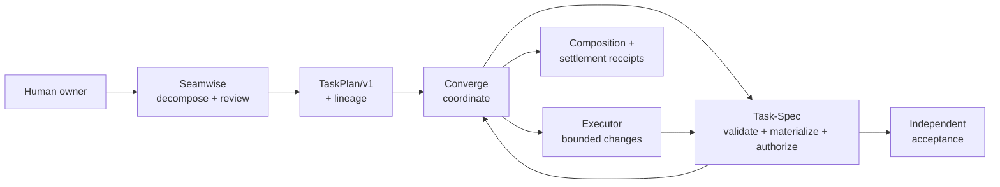

# Authority

Converge coordinates independently versioned engines over executable and JSON
boundaries. It never imports or vendors Seamwise or Task-Spec. Each decision
has one authority. Duplicate capability is tolerable. Duplicate authority is
not.

## Authority table

| Decision or artifact | Sole authority | Explicit non-authority |
|---|---|---|
| Evidence-backed seams, swimlanes, legs | Seamwise | Converge does not reinterpret topology |
| Human acceptance of delivery topology | Named reviewer through Seamwise | Neither engine self-approves |
| `TaskPlan/v1` projection and lineage | Seamwise | Seamwise does not create Task-Spec Markdown |
| TaskPlan validation and task materialization | Task-Spec | Converge does not render or validate Task-Spec internals |
| Task dispatch authorization | Task-Spec `gate --stamp` | Materialization and Seamwise review both record false |
| Runtime contract and path policy | Converge | A Task-Spec cannot widen the repository fence |
| Product-code mutation | Authorized executor | Coordinator and observer do not write product code |
| Evals, handoff, acceptance | Task-Spec | Executor narration is not evidence |
| Cross-engine sequence and composition receipt | Converge | Receipt does not authorize dispatch |
| Workspace observation | Cockpit | Observer cannot mutate canonical state |

## How the boundary is enforced

Compose asks Seamwise for `SeamwiseCapabilities/v1` and refuses the engine if
it claims `materializes_tasks` or `dispatch_authority`. It asks Task-Spec for
`TaskSpecCLIResult/v1` and requires 3.8.x.

`cvg tasks *` is `exec taskspec …`. `cvg decompose` is an alias for
`cvg compose prepare`. The npm package is gated against shipping
`skills/task-spec/` or a Seamwise implementation.

The composition receipt always records `dispatch_authorized: false`. Only
`taskspec gate --stamp` may flip `signed_off` on a leaf.
