# Descent guide

The Converge descent has **two phases with one barrier between them**. Everything
above the barrier (passes 0–4) is human-led design — making intent precise.
Everything below (passes 5–8) is machine-led build — the sealed spec is the only
instruction, the eval is the only judge of done.

## The two phases

### Phase 1 · Design — human-led

| Pass | Skill | Transformation | Gate |
|:--:|---|---|---|
| 0 | `idea-to-brd` (optional) | Raw idea → BRD in owner's voice, or durable no-go | `CHECK_BRD=PASS` |
| 1 | `brd-docs-to-tech-req` | Client BRD → falsifiable tech-spec | `CHECK_TECH_SPEC=PASS` |
| 2 | `tech-req-to-adrs` | Tech-spec + real system → grounding ADRs | `CHECK_ADR=OK` |
| 3 | `reqs-to-swimlane-plans` | ADRs → swimlane tree (plan altitude) | `CHECK_PLAN=OK` |
| 4 | `sketch-plans-adversarial-review` | Plans → hardened plans + objection log + **owner sign-off** | `CHECK_CONSENSUS=OK` |

### The barrier

Pass 4 Consensus is **the barrier**. This is the first moment the plan has
survived a *different model* trying to break it. The owner signs off on the
hardened plans — this is the hand-off from human design to machine build.

### Phase 2 · Build — machine-led

| Pass | Skill | Transformation | Gate |
|:--:|---|---|---|
| 5 | standalone `taskspec` | Accepted legs → atomic Task-Spec DAG with runnable evals | `TIER=1` (HMAC-sealed) |
| 6 | `task-specs-to-issues` (opt-in) | Signed specs → tracker issues + blocked-by graph | `CHECK_REGISTER` parity |
| 7 | `task-to-runtime-contract` | Signed spec → execution profile + guards + task brief | `CHECK_RUNTIME_CONTRACT=PASS` |
| 8 | `task-loop` | Issue → bounded attempts → green eval → PR | `TASK_LOOP=SETTLED` |

## The flowchart

```mermaid
flowchart TB
  START(["Idea, request, or existing BRD"])
  BARRIER{{"THE BARRIER<br/>owner signs off the hardened plans"}}
  STOP["Explicit handoff<br/>BLOCKED · STALLED · EXHAUSTED · CANCELLED · ERROR"]
  DONE(["Settlement evidence<br/>green change ready for human PR review"])

  subgraph DESIGN["PHASE 1 · DESIGN — human-led · make intent precise"]
    direction TB
    P0["0 · CAPTURE · optional<br/>idea-to-brd<br/>frontier questions + do-nothing test<br/>OUT: BRD or no-go · GATE: CHECK_BRD"]
    NOGO(["Durable no-go record<br/>the idea stops honestly"])
    P1["1 · INTENT<br/>brd-docs-to-tech-req<br/>understand → interrogate → crystallize<br/>OUT: falsifiable tech-spec · GATE: CHECK_TECH_SPEC"]
    P2["2 · STRUCTURE<br/>tech-req-to-adrs<br/>ground the spec against the real system<br/>OUT: ADRs + CONTEXT glossary · GATE: CHECK_ADR"]
    P3["3 · DECOMPOSE<br/>reqs-to-swimlane-plans<br/>seam → swimlane → leg<br/>OUT: swimlane tree · GATE: CHECK_PLAN"]
    P4["4 · CONSENSUS<br/>sketch-plans-adversarial-review<br/>cross-family refutation + objection resolution<br/>OUT: hardened plans + log · GATE: CHECK_CONSENSUS"]
  end

  subgraph BUILD["PHASE 2 · BUILD — machine-led · turn agreement into evidence"]
    direction TB
    P5["5 · TASKING<br/>task-spec<br/>leg → atomic task + runnable evals<br/>OUT: sealed Task-Spec DAG · GATE: TIER=1"]
    P6["6 · REGISTER · opt-in<br/>task-specs-to-issues<br/>idempotent 1:1 tracker projection<br/>OUT: issues + blocked-by graph · GATE: CHECK_REGISTER"]
    P7["7 · BIND<br/>task-to-runtime-contract<br/>7A enforceable contract + 7B worker brief<br/>OUT: profile + guards + adapters · GATE: CHECK_RUNTIME_CONTRACT"]
    P8["8 · THE LOOP<br/>task-loop<br/>fresh attempt → tier-1 eval → learn → repeat<br/>OUT: one named TASK_LOOP state"]
    T1{"Task's sealed eval is green<br/>and path policy holds?"}
    T2{"Tier-2 independent refutation<br/>different family + holdout"}
  end

  START --> P0
  START -. "usable BRD: skip optional Capture" .-> P1
  P0 -->|"BRD"| P1
  P0 -->|"do-nothing wins"| NOGO
  P1 --> P2 --> P3 --> P4 --> BARRIER --> P5
  P5 --> P6 --> P7 --> P8 --> T1
  P5 -. "repo-local queue: skip opt-in Register" .-> P7
  T1 -->|"RED · budget remains"| P8
  T1 -->|"RED · stop condition"| STOP
  T1 -->|"GREEN"| T2
  T2 -->|"REFUTED"| P8
  T2 -->|"UPHELD or recorded low-risk UNAVAILABLE"| DONE
  T2 -->|"unavailable + high risk"| STOP

  LANE["ROUTER · cvg lane · not a pass<br/>FAST · NORMAL · FULL<br/>chooses a route; never waives a gate"] -.-> P5

  classDef design fill:#111720,stroke:#F5F2EA,color:#F5F2EA,stroke-width:1.5px;
  classDef build fill:#29313A,stroke:#F5F2EA,color:#F5F2EA,stroke-width:1.5px;
  classDef proof fill:#111720,stroke:#F3B64C,color:#F5F2EA,stroke-width:1.5px;
  classDef terminal fill:#111720,stroke:#F5F2EA,color:#F5F2EA,stroke-width:1.5px;
  classDef stop fill:#111720,stroke:#29313A,color:#F5F2EA,stroke-width:1.5px;
  class P0,P1,P2,P3,P4 design;
  class P5,P6,P7,P8 build;
  class BARRIER,T1,T2,LANE proof;
  class DONE,NOGO,START terminal;
  class STOP stop;
  style DESIGN fill:#070A0F,stroke:#F5F2EA,stroke-width:1px;
  style BUILD fill:#070A0F,stroke:#F5F2EA,stroke-width:1px;
```

## Optional and opt-in passes

- **Capture (Pass 0) is optional.** Client work with a real brief enters at Pass 1; take Capture only when no BRD exists.
- **Register (Pass 6) is opt-in.** Run it for a shared tracker board; skip to keep the queue repo-local in `cvg/tasks/`.

## Workspace discovery

Every pass discovers the **`cvg/` workspace first, then the bare directory**:
`cvg/docs/`, `cvg/docs/adrs/`, `cvg/swimlanes/`, `cvg/tasks/`.

An explicit path always wins. The workspace is not necessarily the git root
(`<repo>/projects/demo/cvg/` is a supported layout).

## Lane routing

`cvg lane` classifies work into `FAST`, `NORMAL`, or `FULL` and **never waives
a gate**.

## Terminal states

| State | Meaning | Exit |
|---|---|:--:|
| `TASK_LOOP=SETTLED` | Green eval, external writes permitted, PR opened | 0 |
| `TASK_LOOP=LOCAL_SETTLED` | Green eval, policy denies external writes — local commit | 0 |
| `TASK_LOOP=NO_OP` | Already green on arrival | 0 |
| `TASK_LOOP=BLOCKED` | Needs a human, or upstream input missing | 1 |
| `TASK_LOOP=STALLED` | Stagnation detector fired | 1 |
| `TASK_LOOP=EXHAUSTED` | Budget ceiling reached; handoff written | 1 |
| `TASK_LOOP=CANCELLED` | External stop signal arrived | 1 |
| `TASK_LOOP=ERROR` | Loop could not continue safely | 1 |

## Related

- [Chat guide](chat.md) — the four-step chat path
- [Skills reference](../concepts/skills.md) — one section per owned skill
- [Skill catalog](../../skills/README.md) — deep essays on each pass
