# The Converge Skill Chain

Eleven self-contained agent skills implement the Converge method — **eight
owned spine skills** (including optional Capture ⓪ and opt-in Register; Pass 5
uses the standalone Task-Spec engine) and **three utility skills**
(`evidence-to-next-pass`, `skill-creator`, `pass-to-lesson`).
Every skill passes
the official validator (checked with
[`skill-creator/scripts/quick_validate.py`](skill-creator/scripts/quick_validate.py)),
and every engine or tracker is bound by a **flag, never a name**.

The method has **two phases with one barrier between them** — Consensus (Pass 4)
is the last human sign-off before the machine takes over. Read this diagram from
top to bottom: every box names the pass, its implementation skill, its core
transformation, and the proof required to leave it.

```mermaid
flowchart TB
  START(["Idea, request, or existing BRD"])
  BARRIER{{"THE BARRIER<br/>owner signs off the hardened plans"}}
  STOP["Explicit handoff<br/>BLOCKED · STALLED · EXHAUSTED · CANCELLED · ERROR"]
  DONE(["Settlement evidence<br/>green change ready for human PR review"])

  subgraph DESIGN["PHASE 1 · DESIGN — human-led · make intent precise"]
    direction TB
    P0["0 · CAPTURE · optional<br/>idea-to-brd<br/>frontier questions + do-nothing test<br/>OUT: BRD or no-go · GATE: CHECK_BRD"]
    NOGO(["Durable no-go record<br/>the idea stops honestly"])
    P1["1 · INTENT<br/>brd-docs-to-tech-req<br/>understand → interrogate → crystallize<br/>OUT: falsifiable tech-spec · GATE: CHECK_TECH_SPEC"]
    P2["2 · STRUCTURE<br/>tech-req-to-adrs<br/>ground the spec against the real system<br/>OUT: ADRs + CONTEXT glossary · GATE: CHECK_ADR"]
    P3["3 · DECOMPOSE<br/>reqs-to-swimlane-plans<br/>seam → swimlane → leg<br/>OUT: swimlane tree · GATE: CHECK_PLAN"]
    P4["4 · CONSENSUS<br/>sketch-plans-adversarial-review<br/>cross-family refutation + objection resolution<br/>OUT: hardened plans + log · GATE: CHECK_CONSENSUS"]
  end

  subgraph BUILD["PHASE 2 · BUILD — machine-led · turn agreement into evidence"]
    direction TB
    P5["5 · TASKING<br/>task-spec<br/>leg → atomic task + runnable evals<br/>OUT: sealed Task-Spec DAG · GATE: TIER=1"]
    P6["6 · REGISTER · opt-in<br/>task-specs-to-issues<br/>idempotent 1:1 tracker projection<br/>OUT: issues + blocked-by graph · GATE: CHECK_REGISTER"]
    P7["7 · BIND<br/>task-to-runtime-contract<br/>7A enforceable contract + 7B worker brief<br/>OUT: profile + guards + adapters · GATE: CHECK_RUNTIME_CONTRACT"]
    P8["8 · THE LOOP<br/>task-loop<br/>fresh attempt → tier-1 eval → learn → repeat<br/>OUT: one named TASK_LOOP state"]
    T1{"Task's sealed eval is green<br/>and path policy holds?"}
    T2{"Tier-2 independent refutation<br/>different family + holdout"}
  end

  START --> P0
  START -. "usable BRD: skip optional Capture" .-> P1
  P0 -->|"BRD"| P1
  P0 -->|"do-nothing wins"| NOGO
  P1 --> P2 --> P3 --> P4 --> BARRIER --> P5
  P5 --> P6 --> P7 --> P8 --> T1
  P5 -. "repo-local queue: skip opt-in Register" .-> P7
  T1 -->|"RED · budget remains"| P8
  T1 -->|"RED · stop condition"| STOP
  T1 -->|"GREEN"| T2
  T2 -->|"REFUTED"| P8
  T2 -->|"UPHELD or recorded low-risk UNAVAILABLE"| DONE
  T2 -->|"unavailable + high risk"| STOP

  LANE["ROUTER · cvg lane · not a pass<br/>FAST · NORMAL · FULL<br/>chooses a route; never waives a gate"] -.-> P5

  classDef design fill:#e8f1ff,stroke:#2864b4,color:#10243e,stroke-width:1.5px;
  classDef build fill:#f1eaff,stroke:#6d45a8,color:#241438,stroke-width:1.5px;
  classDef proof fill:#fff4d6,stroke:#a66a00,color:#3d2800,stroke-width:1.5px;
  classDef terminal fill:#e7f7ec,stroke:#287a43,color:#12351e,stroke-width:1.5px;
  classDef stop fill:#ffe9e7,stroke:#b53a30,color:#441512,stroke-width:1.5px;
  class P0,P1,P2,P3,P4 design;
  class P5,P6,P7,P8 build;
  class BARRIER,T1,T2,LANE proof;
  class DONE,NOGO terminal;
  class STOP stop;
  style DESIGN fill:#f8fbff,stroke:#8baed8,stroke-width:1px;
  style BUILD fill:#fcf9ff,stroke:#a68ac7,stroke-width:1px;
```



**Where the passes look for your work.** Every pass discovers the **`cvg/`
workspace first, then the bare directory** — `cvg/docs/`, `cvg/docs/adrs/`,
`cvg/swimlanes/`, `cvg/tasks/` — and an explicit path always wins. The workspace is
not necessarily the git root (`<repo>/projects/demo/cvg/` is a supported layout),
so everything resolves relative to the workspace: the specs, the execution
profiles, and the directory a spec's own evals run in.

## The nine pass contracts at a glance

The pass names and primary skill mapping are canonical. The implementation
column calls out the mechanism that gives each pass its strongest guarantee;
the gate proves a narrower, machine-checkable claim and never replaces semantic
judgment.

| # | Pass / skill | Core implementation | Durable result / proof |
|:--:|--------------|---------------------|------------------------|
| 0 | **Capture** · [`idea-to-brd`](idea-to-brd/) · *optional* | Frontier interview rounds separate facts from owner decisions; the do-nothing test provides a real no-go exit. | Owner-voice BRD or durable no-go · `CHECK_BRD` |
| 1 | **Intent** · [`brd-docs-to-tech-req`](brd-docs-to-tech-req/) | Trace BRD outcomes into falsifiable requirements, measurable acceptance, and the few decisions that materially change the build. | Verifiable tech-spec · `CHECK_TECH_SPEC` |
| 2 | **Structure** · [`tech-req-to-adrs`](tech-req-to-adrs/) | Inspect the live system, record only hard-to-reverse grounding decisions, and pin one domain vocabulary; no implementation plan leaks in. | `cvg/docs/adrs/*` + `CONTEXT.md` · `CHECK_ADR` |
| 3 | **Decompose** · [`reqs-to-swimlane-plans`](reqs-to-swimlane-plans/) | Cut natural one-way seams, designate a steel thread, and split each lane into independently provable legs while staying above task/code altitude. | `cvg/swimlanes/<seam>/` tree · `CHECK_PLAN` |
| 4 | **Consensus** · [`sketch-plans-adversarial-review`](sketch-plans-adversarial-review/) | A different model family tries to refute every plan; every objection is fixed or explicitly accepted with an owner and provenance. | Hardened plans + stamped objection log · `CHECK_CONSENSUS` + owner sign-off |
| 5 | **Tasking** · [standalone `taskspec`](https://github.com/luanmorenommaciel/task-spec) | Turn accepted legs into atomic, vendor-neutral units whose runnable evals travel with the work; PRE-gate and HMAC seal prevent silent goalpost edits. | Signed Task-Spec DAG under `cvg/tasks/` · `TIER=1` for unattended execution |
| 6 | **Register** · [`task-specs-to-issues`](task-specs-to-issues/) · *opt-in* | Idempotently project one signed spec to one issue and mirror every `depends_on` edge as `blocked-by`; the spec remains canonical. | Tracker shadow + backlinks · `CHECK_REGISTER` parity |
| 7 | **Bind** · [`task-to-runtime-contract`](task-to-runtime-contract/) | Bind one signed revision to least-privilege paths, hash-pinned evidence, honest runtime controls, adapters, and a minimal identifier-only worker brief. | `execution-profile.yaml` + guards + `AGENTS.task.md` · `CHECK_RUNTIME_CONTRACT` |
| 8 | **The Loop** · [`task-loop`](task-loop/) | Run each attempt in fresh context, enforce iteration/time/token ceilings plus stagnation, persist checkpoints, and land in exactly one named state. | Green-eval PR/local commit or explicit handoff · `TASK_LOOP=<state>` + tier-2 `CHECK_VERIFY=<verdict>` |
| util | [`evidence-to-next-pass`](evidence-to-next-pass/) | The sequence layer: derive where the descent stands from workspace evidence, enforce order with pre/post hooks, hand the agent the right pass prompt, and name the optional teaching companion once a pass has closed. Surfaced as `cvg next`. | `NEXT_PASS=` · `PASS_PRE=` · `PASS_POST=` |
| util | [`pass-to-lesson`](pass-to-lesson/) | After any closed pass, teach the owner what was built, why it is shaped that way, and what would break without it. Surfaced as `cvg lesson`. | Durable lesson + teach-ready `CHECK_LESSON=PASS` · *optional* |
| util | [`skill-creator`](skill-creator/) | Author, evaluate, package, and structurally validate agent skills. | Validated skill package |

`cvg verify` belongs to the **Pass 8 runtime story** even though its script is
packaged under `task-to-runtime-contract`: it consumes the bound spec and diff,
then asks a different-family judge to attack held-out criteria before settlement.
The CLI exposes Loop and tier-2 verification separately so neither can silently
manufacture the other's verdict.

**Install into a consuming repo** (pinned copy for Codex, Kimi, and Claude Code):

```bash
bash /path/to/converge/install.sh --target /path/to/project
cd /path/to/project
cvg init
cvg setup signing
cvg setup
```

---

## Phase 1 · Design — the human passes

### 0 · `idea-to-brd` — no brief? capture one (optional)

The on-ramp for non-client work. When there is no client BRD — an internal
idea, a founder thought — this pass grills the *stakeholder's* questions (what
hurts, what it costs, what success looks like) in **frontier rounds**: each
round asks every question whose prerequisites are settled, numbered, each with
a recommended default, and one reply answers the whole round — looking up
facts in the environment and asking only the decisions. It drafts the BRD in
the owner's voice, self-reviews it (placeholders, consistency, ambiguity,
altitude), and stops at the brief — never the spec. When the do-nothing test
shows tolerable inaction it takes the no-go exit instead (`docs/no-go-*.md`).
Client work with a real brief skips this pass entirely.
**Ships:** `check-brd.sh` (the gate linter), `references/brd-template.md`. **Flags:** `--out-format md|pdf`, `--questions batch|one`.
**Gate:** the pain carries a provenance-tagged number, at least one KPI is in the owner's terms, scope in/out are non-empty, every open question has a named owner.

### 1 · `brd-docs-to-tech-req` — the client hands you the problem; you produce the spec

Reads a client BRD like a senior engineer, not a stenographer: finds the real
problem underneath the ask, grills the 2–3 questions whose answers most change
the build (frontier rounds, recommended defaults — one reply answers the
round), and crystallizes one tech-spec with falsifiable requirements and
metrics traced to the BRD's KPIs. Ambiguity killed here is the cheapest kill in
the whole descent.
**Ships:** `check-tech-spec.sh` (the gate linter). **Flags:** `--engine cowork`, `--out-format pdf`, `--questions batch|one`.
**Gate:** you can restate the client's problem in one breath and show the spec answers it.

### 2 · `tech-req-to-adrs` — greenfield or brownfield, and write the ADRs

Names the ground (brownfield = a system you didn't write), opens the system end
to end, reconciles the spec against real schemas, sources, and jobs, and records
each grounding decision as a numbered ADR under `docs/adrs/` — each one passing
the three-condition worthiness test (hard to reverse · stood on downstream ·
could have been otherwise). Domain terms are pinned in a `docs/CONTEXT.md`
glossary as they crystallize, so every later pass speaks one vocabulary. ADRs
record what is *true* — never how to build; the moment an ADR says "build X",
you've drifted into planning.
**Ships:** `scaffold-adr.sh`. **Engine:** fixed — Claude Code on the repo.
**Gate:** terrain understood, every grounding decision recorded durably.

### 3 · `reqs-to-swimlane-plans` — split the work along its natural seams

Same session as Pass 2, ADRs in hand: cuts where the system is already jointed
(feature or component edges) and gives each seam exactly one focus-oriented
sketch plan under `swimlanes/*.plan`. The decomposition chain is
**seam → swimlane → leg → task-spec**; a leg is a lane's named stretch (one
responsibility, one proving test) that yields 1:N task-specs at Pass 5. The
right number of lanes is the number of genuine seams — no more, no fewer.
Plan-altitude only: no tasks, no SQL.
**Ships:** `new-plan.sh`.
**Gate:** one plan per genuine seam, each inheriting the relevant ADRs.

### 4 · `sketch-plans-adversarial-review` — a different model refutes · **THE BARRIER**

A model won't refute itself hard enough, so this pass binds a *different-family*
engine (`--adversary codex|kimi|claude`) as a skeptic who defaults to "refuted,"
attacking the plans one at a time (PRD then legs) and stamping a provenance-hashed
objection log. Every objection is FIXED in a plan or ACCEPTED with a named owner —
nothing silently dropped. **This pass is the barrier:** it is the last place a
human signs off before the work crosses into the machine. Everything upstream is
human-led design; everything downstream is machine-led build.
**Ships:** `check-consensus-gate.sh`, `references/attack-playbook.md`, `references/the-fork.md` (why the fork is retired → the barrier), `references/engine-adapter.md`.
**Gate:** no open objection survives **and** the owner signs off — the hand-off to the machine.

---

## Phase 2 · Build — the machine passes

### 5 · standalone `taskspec` — Tasking · the cornerstone unit · v3.x

The independently installed engine is the deepest contract in the chain: atomic, vendor-neutral, **self-verifying**
Task-Spec units. Each `tasks/T-*.md` carries YAML frontmatter + six zones +
≥3 runnable bash evals + an Exit Check — the definition of done travels inside
the file. Two gates are duals: `safe-to-delegate.sh --stamp` (PRE — certifies
the *spec*, HMAC-seals the evals so the spec is the only trusted instruction
source) and `accept-task.sh --stamp` (POST — certifies the *work*: clean-checkout
eval pass, blast radius, HMAC recheck, optional gold-sanity Goodhart guard).
Locked atomic status transitions, a rebuildable state index, an append-only
metrics ledger, an L0–L2 executor conformance suite, and dispatch recipes
(Claude, Codex, Kimi, Gemini, taskship, anthive, custom) round out the runtime.
**Converge consumes:** the external CLI and its published contracts; it does not install a mirrored Task-Spec skill.
**Gate:** every task carries a runnable eval — *no eval, not a task yet.*
Full details: [Task-Spec repository](https://github.com/luanmorenommaciel/task-spec) · deep-dive PDF: [`task-spec-v0.1.pdf`](https://github.com/luanmorenommaciel/converge/releases/download/v0.1.0/task-spec-v0.1.pdf).

### 6 · `task-specs-to-issues` — the tracker as state · **opt-in**

Optionally projects each signed-off Task-Spec onto exactly one tracker issue
(`--tracker github|linear|jira`), with `blocked-by` links carrying the
`depends_on` graph — so the execution loop reads a board instead of re-deriving
state. Skip it to keep the queue repo-local. On Linear it also seeds native
fields from the spec (assignee via `.cvg/identity`, state from DAG position,
subscribers) and honors an optional `projection:` block (cycle/parent/sla +
opt-in Initiative→Project→Milestones). Only the loop writes state; only a green
eval closes an issue — so the board never lies.
**Ships:** `register.sh`, `verify-registration.sh` — a **real 1:1 parity gate** (count · orphan · missing · dup) over a six-verb adapter contract.
**Gate:** `count(issues) == count(signed-off specs)`, every dependency edge is one link, no orphans, no cycles.

### 7 · `task-to-runtime-contract` — bind one task to its runtime + emit the harness

Two moves. **(7a) Contract:** verifies one signed runnable Task-Spec, binds its
exact hash to the smallest evidence slice, defaults to one agent (escalating a
task-local topology only when static evidence justifies it), and emits portable
path guards. **(7b) Harness:** auto-detects the available engines and emits the
multi-engine context glue — **AGENTS.md** (universal doctrine + this task's
contract) plus **CLAUDE.md / codex / cloud** adapters — so the *same* sealed task
runs on `claude -p`, `codex exec`, a Kimi swarm, or a cloud workflow. *The harness
orchestrates; the documentation teaches* — external docs are cached and hashed,
approved knowledge referenced, never copied.
**The capability envelope.** Authority is granted against **one signed revision**
(`epoch = <task-id>@<spec-sha12>`), scoped to the Task-Spec's own paths, and
**revoked on settle, block, budget exhaustion, or epoch change** — closing the
*lingering authority* hole where session-scoped permissions outlive the task that
justified them. Each adapter then declares, per capability, whether the runtime
**prevents** the violation (Landlock/seccomp, Seatbelt, pre-tool hooks), only
**detects** it (portable postflight), or **cannot honor it** — and a required
control the runtime cannot enforce **fails the gate closed** unless waived in the
open. `cvg doctor runtime-contract` attests what the host can genuinely do.
**7A contract / 7B brief.** 7A is what the RUNTIME enforces; **7B** is the task
brief the MODEL reads (`AGENTS.task.md`) — epoch, writable paths, fences, the Exit
Check, and a pointer to the project router. It holds **identifiers, not content**:
auto-generated context measurably lowers task success while raising cost, so the
brief states only what a worker cannot infer. `cvg setup harness` scaffolds the
project router once (~50 lines, routing only — cvg never writes doctrine).
**Tier-2 verification.** `cvg verify` has a **different-family** engine grade the
diff against the spec's intent and a **holdout** the implementer never saw, prompted
to refute. Fails closed: no verdict is never a pass. With no second engine the
result is `UNAVAILABLE` — fine for low blast radius, blocked for high unless
explicitly waived. See [`references/verification.md`](task-to-runtime-contract/references/verification.md).
**Ships:** deterministic binder, readiness gate (read-only), task-brief writer, candidate/diff path guard, tool-hook bridge, adapter + resolver manifests, host attestation, tier-2 verifier, router scaffold, execution receipts.
**Gate:** `CHECK_RUNTIME_CONTRACT=PASS` — sign-off, freshness, evidence, topology substance, ownership, capability closure, and honest assurance all verify.

### 8 · `task-loop` — one issue → green-eval PR

The execution loop is the single-task worker primitive; the Manager that leases
and schedules it across the frontier is a separate, still-future layer. It takes
ONE issue (`--issue N`), verifies its Pass 7 execution
profile, reads the signed Task-Spec + hash-bound evidence (**the only instruction
source**), cuts a branch, and then **actually loops**: attempt → verify → learn →
repeat, until the task's own eval exits 0. GREEN may publish only after the
portable path guard passes and the standalone Task-Spec engine independently
accepts the attempt-bound handoff and writes `AcceptanceRecord/v1`.
**A gate is not a loop.** Until `loop-kernel.sh`, this pass ran the eval *once*
while every spec declared `budget_iterations` and `circuit_breaker_no_progress`
that **nothing enforced** — a control in the artifact and not in the runtime. The
kernel makes the loop specification executable: **each attempt is a fresh process**
(state on disk, never a growing conversation, because a retry otherwise re-reads
every prior failure at quadratic cost and degrading attention); **budgets are
three-axis** (iterations · wall-clock · tokens) and checked *before* the call,
where the money has not yet been spent; **stagnation beats a fixed count** — the
same failure the same way N times lands `STALLED` instead of burning the remainder;
and **exhaustion is a planned landing** — work-in-progress committed, `HANDOFF.md`
written, `--resume` available. Engines are one adapter file each
(`scripts/engines/<name>.sh`, two calls: `--available`, `--prompt-file`), so the
kernel spells no vendor and a hung CLI dies at a watchdog cap.
**Ships:** `loop-kernel.sh` (the loop), `run-issue-eval.sh` (the level-1 check), `open-issue-pr.sh` (the settlement leg), `engines/{claude,codex,kimi}.sh`, `references/loop-spec.md` (the design + its sources), `references/blocked-task-report.md`. **CLI:** `cvg loop --issue <id>`. **Flags:** `--issue N` (required), `--agent claude|codex|kimi`, `--no-agent`/`--gate-only`, `--max-iterations|--max-seconds|--max-tokens` (tighten only), `--resume`, `--dry-run`, `--allow-external-writes`. **Emits one named terminal state:** `TASK_LOOP=SETTLED|LOCAL_SETTLED|NO_OP|BLOCKED|STALLED|EXHAUSTED|CANCELLED|ERROR` — only the first three exit zero, because an error or an exhausted budget is never a success.
**Gate:** the task's own eval is green — none by hand, none by attempt-count.

---

## Utilities

### `evidence-to-next-pass` — the sequence layer (above every pass)

The descent's order, machine-derived: every pass leaves evidence in a known
`cvg/` folder, so position is always readable from the workspace — no stored
state, no memory, no drift between sessions. `scripts/next-pass.sh` answers
`next` (evidence board + `NEXT_PASS=`, the steering prompt, the closing gate —
surfaced as **`cvg next`**), `pre N` (fail-closed door: refuse pass N until
every prior lane pass left its artifact), and `post N` (did this pass fill its
folder?). `cvg next --guided` adds stable `CONTINUE`, `EXPLAIN`, `INSPECT`, and
`PAUSE` choices, then requires the agent to wait. It persists no chat state and
does not create another sequence. Owns the pass→skill map that resolves each steering prompt — every
pass skill carries its own at `references/pass-prompt.md`, shipped with the
package and never copied into a project. Lane-aware (`--lane FULL|NORMAL|FAST`),
read-only, instant (presence probes, no gate execution). **Evidence presence
is never a verdict** — the `cvg` gates stay authoritative.
**Ships:** `next-pass.sh` · the folder-discipline map · guided-chat contract · hermetic suite (44 checks).

### `pass-to-lesson` — the teaching companion (optional, after any pass)

Converge delegates the writing, never the understanding. After any pass's gate
goes green, this companion reads everything the pass emitted and teaches it
back — every component gets *what it is · why it's shaped this way · the
decision it encodes · what breaks downstream without it* — plus the decisions
and their rejected alternatives, a vocabulary of every term of art, and a
closing Feynman quiz. The lesson persists at `cvg/docs/lessons/lesson-*.md` (the
folder `cvg init` creates), so understanding survives the session. It explains
decisions, never reopens them. Optional, and it never blocks the descent — but
not invisible: `cvg lesson` is its gate door and `cvg next` names it wherever a
pass has closed.
**Ships:** `check-lesson.sh` (the gate linter), `references/pass-prompt.md` (its steering prompt), `references/lesson-template.md`. **Flags:** `--depth full|brief`, `--quiz on|off`, `--level eli5|novice|expert`, plus the seven composable teaching modes.
**Gate:** every emitted artifact taught, every decision names a rejected alternative, every term defined, 3–5 check-yourself questions, artifacts untouched (`cvg lesson --immutable` proves the last one).

### `skill-creator` — author, evaluate, validate

Anthropic's skill-authoring toolkit, vendored so the chain can maintain itself:
create/edit skills, run eval benchmarks (`run_eval.py`, `run_loop.py`,
grader/comparator/analyzer agents), package for distribution, and validate
structure (`quick_validate.py` — the check every skill in this folder passes).
**Ships:** 9 Python scripts + an eval-viewer (its own `generate_review.py`).

**By the numbers:** 11 Converge skill packages (8 owned spine + 3 utility), with
full tests around the standalone Task-Spec boundary and runtime contracts.

> *"You are converged when the eval passes — not when you feel done."*
