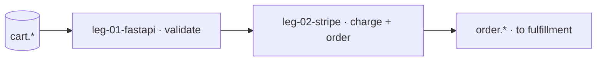

# Swimlane · checkout

lane-meta: thread=no · risk=high · owner=payments-stream

Component **A · Checkout** — turn a validated cart into a paid order.
Input contract: `cart.*`. Output contract: `order.*` (the seam the fulfillment lane consumes).

> **This is the swimlane PRD — a lean INDEX over the legs.** Full detail lives in
> each `swimlane-checkout-leg-NN-<tech>.md`. Black-box altitude only.

## Seam

Where this lane cuts: **above the cart, below the order contract.** `cart.*` is given
upstream; `order.*` is published downstream and is all the fulfillment lane reads.
One-way: checkout produces the order, fulfillment consumes it.

## Architecture



Step-by-step:

1. A validated cart enters the checkout API.
2. leg-01 confirms the cart is purchasable; leg-02 charges and writes the order.
3. `order.*` is published; fulfillment consumes only that.

## Non-Goals

- No cart editing (that is the cart lane).
- No shipment scheduling (that is fulfillment).
- No refunds in v1.

## Legs — index (full detail in each file)

| Leg | Responsibility (one line) | File |
|---|---|---|
| **leg-01-fastapi** | validate the cart is purchasable | [swimlane-checkout-leg-01-fastapi.md](swimlane-checkout-leg-01-fastapi.md) |
| **leg-02-stripe** | charge and write the order record | [swimlane-checkout-leg-02-stripe.md](swimlane-checkout-leg-02-stripe.md) |

Stable keys: `swimlane-checkout-leg-01/02` — the `<tech>` suffix is a swappable label.

## Dependencies

```
cart.*  ->  leg-01  ->  leg-02  ->  order.*
```

## Build order

1. **leg-01** — validate first; nothing charges an invalid cart.
2. **leg-02** — charge + order once validation holds.

## Open questions

| # | Item | Owner | Blocks build? |
|---|---|---|---|
| Q1 | which currencies at launch? | payments-stream | No |

## Spec traceability

- **R-1 · R-2** — grounded per leg; see each leg file.
