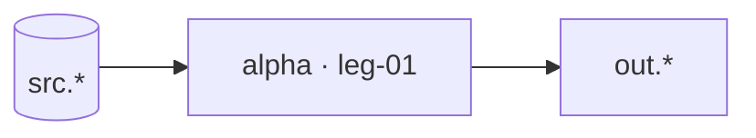

# Swimlane · alpha

FORK: B (task-driven) — every leg carries a cheap runnable eval, so task-by-task convergence beats one big run.

lane-meta: thread=yes · risk=med · owner=team-a

Component **A · Alpha**. Input: `src.*`. Output: `out.*` (the seam beta consumes).

## Seam

Alpha cuts above `src.*`, below `out.*`. One-way.

## Architecture



## Non-Goals

- No serving.

## Legs — index

| Leg | Responsibility | File |
|---|---|---|
| **leg-01-tool** | do the one thing | [swimlane-alpha-leg-01-tool.md](swimlane-alpha-leg-01-tool.md) |

## Dependencies

```
src.*  ->  leg-01  ->  out.*
```

## Build order

1. **leg-01**.

## Open questions

| # | Item | Owner | Blocks build? |
|---|---|---|---|
| Q1 | none | team-a | No |
