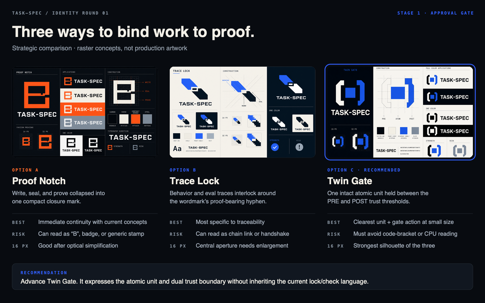
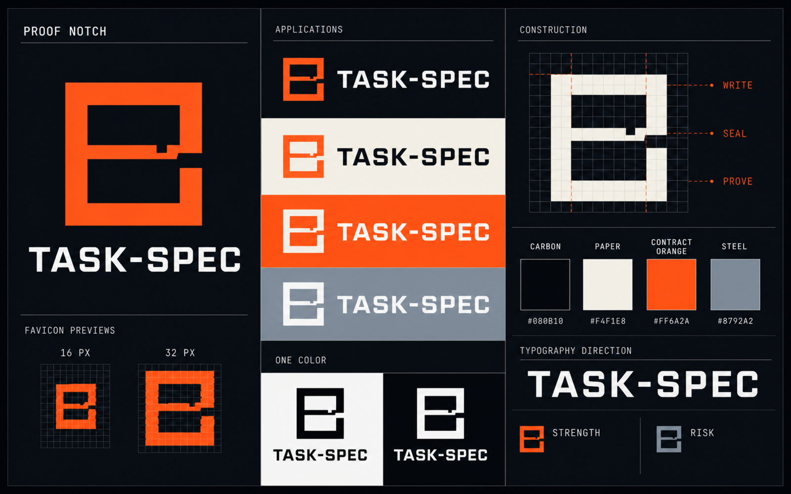
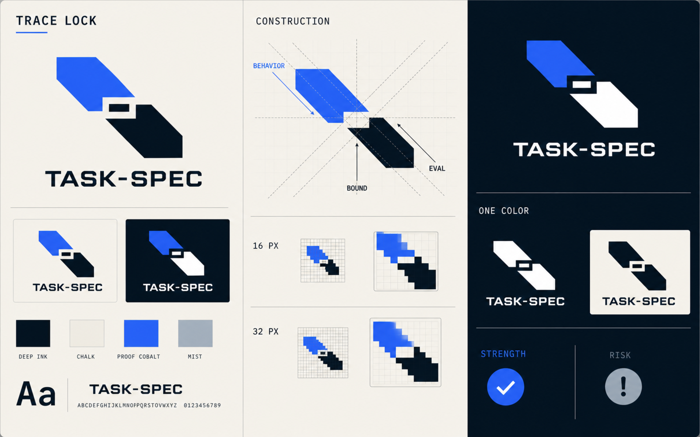
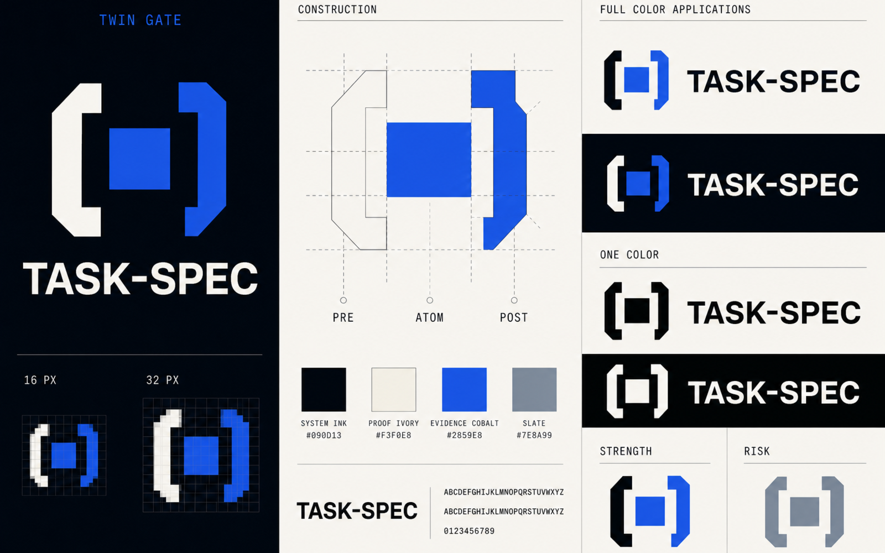

# Task-Spec Identity · Round 01

Stage 1 is complete. These are raster identity directions for approval, not
production logo masters. No option is canonical yet, and `brand-kit-v1/` has
not been started.

## Recommendation

Advance **Option C — Twin Gate**.

It is the clearest compression of Task-Spec’s actual role: one unchanged atomic
unit held between the PRE and POST trust boundaries. It has the strongest 16 px
silhouette, does not require a checkmark or lock, and is the most independent of
the current `assets/` experiments, Seamwise’s architectural seam, and
Converge’s settlement fold.

Its principal risk is a code-bracket or processor reading. Stage 2 can reduce
that risk by making the thresholds more asymmetric, tuning the center-to-gate
ratio, and testing the mark beside real code and developer-tool icon sets.

## Comparison

| Direction | Strategic idea | Strongest quality | Primary risk | Small-size outlook |
| --- | --- | --- | --- | --- |
| A · Proof Notch | An authored contract closes into a proof-bearing stamp. | Familiar bridge from the existing Write → Seal → Prove concept. | Reads as a `B`, badge, or generic stamp. | Good after reducing the inner notch. |
| B · Trace Lock | Behavior and eval traces interlock through a proof-bearing hyphen. | Most specific to bidirectional traceability. | Reads as a chain link, handshake, or transfer arrows. | Viable, but the center aperture needs enlargement. |
| C · Twin Gate | One atomic unit remains intact between PRE and POST thresholds. | Best balance of product truth, simplicity, and ecosystem separation. | Reads as code brackets, chip, or processor. | Strongest of the three. |

The detailed strategy and repo evidence boundary are in [BRIEF.md](BRIEF.md).

---

## Option A — Proof Notch

### Strategic rationale

This is the permitted evolution of the existing **Write → Seal → Prove**
territory. It removes the document, padlock, wax ring, glow, and terminal
checkmark, then compresses the sequence into one abstract closure.

### Core metaphor

An open contract frame acquires a locking crossbar and a terminal notch. The
notch makes the closure visibly specific: remove or alter it and the silhouette
changes.

### Product action

- **Write:** the open frame admits intent and executable criteria.
- **Seal:** the central bar binds the artifact into one contract.
- **Prove:** the terminal notch marks the closed, inspectable verdict surface.

The mark suggests this action; it does not claim that HMAC proves identity or
that an eval proves more than it asserts.

### Proposed icon and wordmark

- Icon: heavy squared frame, central locking bar, one proof notch.
- Wordmark: uppercase `TASK-SPEC` with a drawn, visible hyphen and squared
  terminal details that echo the icon.
- Light application: carbon wordmark with contract-orange icon on paper.
- Dark application: paper wordmark with contract-orange icon on carbon.
- One color: full silhouette in black or white; no separate checkmark.

### Small-size and construction

- 32 px: the three structural moves remain apparent.
- 16 px: the notch survives, but the mark approaches a `B`; Stage 2 would widen
  the internal apertures and reduce the lower-right gap.
- Construction: square modules; two equal internal counters; one asymmetric
  terminal cut.

### Initial visual system

- Carbon `#080B10`
- Paper `#F4F1E8`
- Contract Orange `#FF6A2A`
- Steel `#8792A2`
- Type direction: squared grotesk display wordmark with a neutral sans for
  communications and a mono face for technical labels.

Contract Orange is a candidate brand accent only. Semantic RED, accepted, and
parked colors would be designed separately in Stage 2.

### Strengths

- Fastest continuity with the current concept work.
- Simple enough for one color and favicon use.
- Feels like a compact stamp without illustrating a wax seal.

### Risks and likely misreadings

- The silhouette strongly resembles a capital `B`.
- It can feel like a certification badge rather than an executable contract.
- The orange territory sits closer to Converge’s Forge Gold than the preferred
  cobalt direction.

### Relationship to existing assets

The current untracked `assets/` show a page, eval block, lock/seal, checkmark,
cyan/amber/green state colors, and the line “Write it. Seal it. Prove it.”
Proof Notch preserves only that strategic sequence. It discards the literal
page, padlock, checkmark, three-stage diagram, gradients, and glow.

---

## Option B — Trace Lock

### Strategic rationale

This direction makes the most Task-Spec-specific structural rule visible:
behavior and eval traceability must close in both directions. It treats the
wordmark hyphen as the binding point rather than incidental punctuation.

### Core metaphor

Two opposing traces meet through a central rectangular aperture. Neither rail
is complete alone; together they form one bound verification pair.

### Product action

- The upper trace represents declared behavior.
- The lower trace represents runnable eval evidence.
- The central aperture is the explicit mapping that binds each side.
- The same paired unit can move between conformant executors without changing
  the contract.

### Proposed icon and wordmark

- Icon: two opposing diagonal rails with clipped ends and a central negative
  rectangle.
- Wordmark: uppercase `TASK-SPEC`; the hyphen repeats the central aperture’s
  proportions.
- Light application: cobalt and deep ink on chalk.
- Dark application: cobalt and chalk on deep ink.
- One color: both traces and the central aperture remain legible in black or
  white.

### Small-size and construction

- 32 px: clear pairing and directionality.
- 16 px: the aperture starts to close; Stage 2 would enlarge it and shorten the
  rails.
- Construction: two equal-width traces on opposing diagonals, joined by a
  centered rectangular negative-space unit.

### Initial visual system

- Deep Ink `#07111B`
- Chalk `#F3F1E9`
- Proof Cobalt `#315EFB`
- Mist `#A8B4C1`
- Type direction: compact neo-grotesk with IBM Plex Mono–style technical
  annotation. Typeface licensing and the final wordmark construction remain a
  Stage 2 decision.

### Strengths

- Most directly tied to behavior↔eval traceability.
- Makes the mandatory hyphen part of the identity logic.
- Distinct from the current seal/check concept.

### Risks and likely misreadings

- Can read as a chain link, handshake, data transfer, or two tags.
- Directionality may imply movement more strongly than a bounded artifact.
- The diagonal gesture is less stable at 16 px than Twin Gate.

### Relationship to existing assets

Trace Lock retains no page, seal, padlock, ring, or checkmark. It departs from
the current palette and from the Write → Seal → Prove narrative. It also avoids
Seamwise’s vertical seam and branching rails: these are two local traces inside
one unit, not an architecture graph.

---

## Option C — Twin Gate

### Strategic rationale

Task-Spec is the atomic contract between broader discovery and execution
systems. Twin Gate shows that exact role without attempting to draw the entire
lifecycle: one unit, two trust thresholds, unchanged internal contract.

### Core metaphor

A solid atomic cell is held between two asymmetric gates. The left threshold
admits authorized work; the right threshold releases an evidence-backed result.

### Product action

- **PRE:** validate and authorize the bounded contract.
- **ATOM:** preserve the same behavior, eval, guardrail, and budget contract.
- **POST:** rerun evidence, verify scope and integrity, then permit acceptance.

The mark does not imply that every current POST-gate run occurs in a clean
checkout; it represents the two implemented trust boundaries.

### Proposed icon and wordmark

- Icon: one square cell between two clipped, asymmetric threshold brackets.
- Wordmark: uppercase `TASK-SPEC`, with the hyphen sized as a visible unit rather
  than a hairline.
- Light application: system ink, evidence cobalt, and proof ivory.
- Dark application: proof ivory and evidence cobalt on system ink.
- One color: one continuous black or white silhouette, with the center cell
  remaining distinct.

### Small-size and construction

- 32 px: thresholds and center cell are immediately distinct.
- 16 px: strongest recognition in the round; the symbol retains three parts
  without relying on detail.
- Construction: a square atomic unit on the center axis; equal threshold mass
  with intentionally unequal entry and exit cuts.

### Initial visual system

- System Ink `#090D13`
- Proof Ivory `#F3F0E8`
- Evidence Cobalt `#2859E8`
- Slate `#7E8A99`
- Type direction: disciplined grotesk display wordmark, neutral sans for prose,
  and open-source mono for CLI/evidence surfaces.

Evidence Cobalt is the strongest master-accent candidate because accepted green,
RED/failure, amber/supervision, and parked gray can remain clearly semantic.

### Strengths

- Clearest atomic-unit and dual-gate story.
- Strongest 16 px and one-color behavior.
- Most independent of the existing asset concept and adjacent-project marks.
- Naturally supports state applications without making state color part of the
  master icon.

### Risks and likely misreadings

- May read as code brackets, a chip, or a processor.
- The center square can feel static unless the threshold cuts carry sufficient
  direction.
- Over-rounding would make it generic; over-sharpening would make it feel
  militarized.

### Relationship to existing assets

Twin Gate preserves only the existence of PRE and POST trust boundaries. It
removes the current page, padlock, wax ring, checkmark, and three-color journey.
It also avoids Converge’s hexagonal fold and Seamwise’s opposing plates by using
a singular center cell and two local threshold forms.

---

## Existing-asset boundary

The following were inspected but not changed:

- `assets/taskspec-mark.svg`
- `assets/taskspec-logo.svg`
- `assets/taskspec-banner.svg`
- `assets/taskspec-banner.png`
- `assets/taskspec-hero.svg`

They remain local, untracked concept work. None of the Round 01 files replaces
them or changes the current README integration.

## Generation and review method

- Strategy and claims were grounded in the live repository before concepting.
- The two reference kits were used for restraint, coverage, file organization,
  and QA expectations only.
- The three sheets were generated separately with the built-in image-generation
  path using three independent concept prompts.
- Each sheet was normalized to a true 1600 × 1000 (16:10) PNG and visually
  inspected after placement in the repository.
- The sheets prove visual direction only. Their geometry, type, gradients, and
  optical spacing are not production masters.

Prompt summaries:

1. **Proof Notch:** abstract open square + central locking bar + terminal proof
   notch; carbon/paper/orange; no document, lock, shield, or checkmark.
2. **Trace Lock:** two opposing behavior/eval traces bound through a central
   rectangular hyphen; ink/chalk/cobalt; no seal, loop, or chain-link cliché.
3. **Twin Gate:** one solid atomic square between asymmetric PRE and POST
   thresholds; ink/ivory/cobalt; no fold, loop, code braces, or processor detail.

## Approval gate

Please choose **A — Proof Notch**, **B — Trace Lock**, or **C — Twin Gate**, or
request a bounded refinement of one direction. Stage 2 begins only after
explicit approval.
