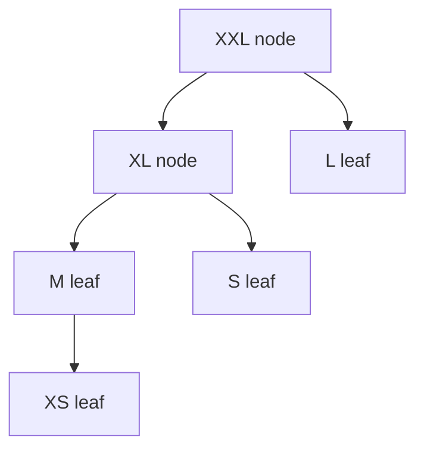

# Effort and composition gate

Task-Spec v3 uses six sizes and two kinds of unit. Size is a decomposition
signal, not a vendor ranking.

| Size | Kind | Write-surface budget | Rule |
|---|---|---:|---|
| XS | Leaf | 1 | Directly runnable |
| S | Leaf | 2 | Directly runnable |
| M | Leaf | 3 | Directly runnable |
| L | Leaf | 5 | Directly runnable only on a configured long-horizon backend and with one coherent done-condition |
| XL | Node | 0 | At least two child Task-Spec ids; never delegated |
| XXL | Node | 0 | At least three child Task-Spec ids; never delegated |

The write surface is `touches_paths ∪ creates_paths`, counted uniquely. A leaf
above its budget warns because the declared atom is probably coarse. A node with
a write path fails because the children—not their composition parent—own work.

## Long-horizon backends

`execution_backend` remains an open string. The default L-eligible set is:

```text
glm claude codex kimi
```

An installation may change it without changing the format:

```bash
export TASKSPEC_LONG_HORIZON_BACKENDS="claude codex kimi glm my-harness"
```

The rule is capability-based: an L leaf needs a long-horizon builder. The core
does not claim that one current model vendor is universally best.

## Composition is still Task-Spec



An XL/XXL node is a reviewable decomposition and composition unit. It names
children but is not a runnable leaf, cannot be sealed for delegation, and has no
write surface. A worker receives a child handoff; a higher-level system may
compose child outcomes back into the node.

## Classification questions

Classify from the actual repository, not estimated elapsed time alone:

1. How many existing and new paths may be written?
2. Do the reads, spec, and likely diff fit in one fresh executor context?
3. Is there one coherent machine-checkable done-condition?
4. Are multiple outcomes independently valuable or independently reversible?
5. Does a wide refactor need expand → migrate batches → contract leaves?

If multiple outcomes can succeed or fail independently, split them and connect
the leaves with `depends_on`. If a task is large because its design is still
unknown, use the appropriate design process first, then express approved build
units as Task-Spec leaves/nodes.

## Related

- [Decomposition](decomposition.md)
- [Profiles](profiles.md)
- [Task-Spec v3](../../spec/task-spec-v3.md)
