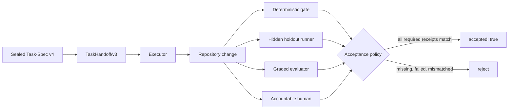

# Evaluation policy

Format v3 answers: “Did the declared checks pass, within the declared scope,
without changing the authorized contract?” Format v4 adds: “Which independent
forms of evidence must exist before that result may be accepted?”

The distinction matters because different claims need different referees.
Compilers and tests are excellent at deterministic behavior. A hidden holdout
can detect overfitting to visible checks. A rubric can assess bounded qualities
that are not binary. A named human remains responsible for meaning, risk, or
policy decisions that data and code cannot own.

The executor sees the policy, not the private evaluator implementation:

Use `local` when evidence is meaningful only in the current checkout. Use
`portable` when another environment must reproduce it; this requires an
environment contract. Use `human-authorized` when human acceptance is the
dominant final boundary.
