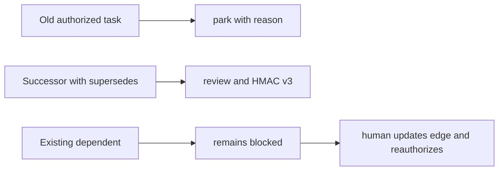

# Replanning and recovery

Adaptation is a new authorization, never silent authority expansion.

## Small correction

Edit the same task, rerun validation and DoD, then restamp it. The prior handoff
and all receipts for that revision are stale.

```bash
taskspec validate tasks/T-…-leaf.md
taskspec dod tasks/T-…-leaf.md
taskspec gate --stamp tasks/T-…-leaf.md
taskspec handoff tasks/T-…-leaf.md --backend codex --out new-attempt.json
```

## Materially different or partially executed work

Create a successor with `supersedes: <old-id>`, park the predecessor with a
reason, and explicitly update/re-authorize each dependent. Task-Spec never
rewrites downstream edges and rejects runtime-created dependencies.



## Interrupted mutation

All lifecycle and acceptance frontmatter replacements are atomic under a
portable mkdir lock. After an interruption:

```bash
taskspec doctor --backlog
taskspec graph --check
taskspec rebuild-state
taskspec status T-…
```

The doctor reports stale temporaries, narrow seals, orphan or mismatched
acceptance records, invalid graph state, and missing metrics projections.
Repair only the named projection; Task Markdown, Git, and AcceptanceRecords are
the canonical evidence.
