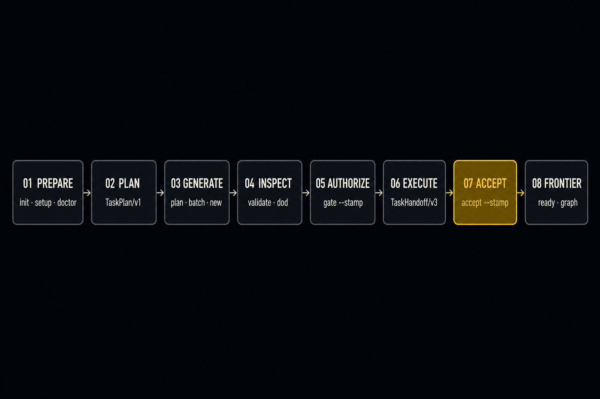
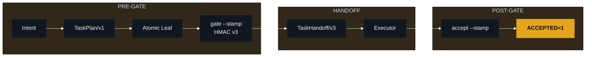
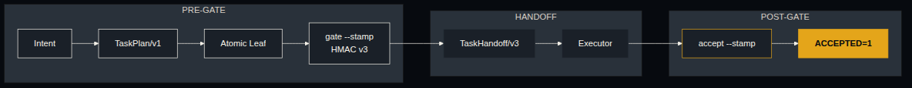

<div align="center">

<!-- Receipt Gate hero: Factory Black lockup, PRE taller / POST shorter, Proof Gold verdict -->
<picture>
  <source media="(prefers-color-scheme: dark)" srcset="assets/task-spec-hero.png">
  <source media="(prefers-color-scheme: light)" srcset="assets/task-spec-hero.png">
  
</picture>

<p><strong>Agents can write code. TASK-SPEC makes them earn <code>done</code>.</strong></p>
<p>One open contract for bounded scope, executable proof, sealed authority,<br/>portable handoff, and independent acceptance.</p>

[](CHANGELOG.md)
[](spec/task-spec-v4.md)
[](#requirements)
[](#trust-boundaries)
[](LICENSE)

Works with **Codex · Claude Code · Kimi · Grok Build · Cursor · any conformant executor**

[Prove it](#prove-it-in-one-command) · [Chat](#chat-experience) · [Install](#installation) · [Use it](#step-by-step-usage) ·
[TaskMesh](#what-shipped-in-39) · [How it works](#how-it-works) · [Trust](#trust-boundaries) · [Docs](#documentation)

</div>

---

## The missing contract between intent and execution

A prompt tells an agent what you want. A Task-Spec also records what the agent
may change, what observable behavior counts as success, what evidence must
exist, who authorized that exact contract, and what an independent gate must
verify afterward.

| Without Task-Spec | With Task-Spec |
|---|---|
| "Implement search and test it." | One atomic leaf with explicit paths, behavior, evals, budget, and owner |
| The agent decides what "done" means while working | Humans review the contract; runnable evals decide the technical result |
| Scope changes disappear into the conversation | HMAC v3 seals a canonical task revision, including future fields by default |
| Every harness receives a different interpretation | Every harness receives the same attempt, revision, base commit, closure, scope, and budget |
| "Tests pass" is the final claim | Acceptance reruns proof, checks Git history and the worktree, binds receipts, and writes an auditable record |

The core stops at that boundary. It does not host models, store credentials,
create a sandbox, or turn a weak eval into a wise oracle. Version 3.9 adds
**TaskMesh** as an optional runtime: it can route and execute already-authorized
leaves, but it cannot change the contract or accept work on its own terms.

## Prove it in one command

After installation, run a complete lifecycle in a disposable repository:

```console
$ taskspec demo
Task-Spec isolated lifecycle
  PLAN=VALID
  DOD=COMPLETE
  VERDICT=DELEGATE TIER=1
  HANDOFF=TaskHandoff/v3
  EVAL=PASS
  ACCEPTED=1
DEMO=READY
```

`taskspec demo` creates an isolated Git repository, writes and validates a real
`TaskPlan/v1`, generates one atomic leaf, seals it, emits a portable handoff,
runs its eval, accepts the result, and removes the repository. It does not touch
the repository from which you invoke it. Executed proof:
`tests/test-demo.sh` and `tests/test-v36-experience.sh`.


## Chat experience

The CLI is the referee. The skill is how a coding agent finds that referee.
After `install.sh --global --copy` (or `--target` for one repo), the same
`SKILL.md` lands in every supported harness. The in-repo pack
[`skills/task-spec`](skills/task-spec/SKILL.md) is a byte-for-byte copy of
root [`SKILL.md`](SKILL.md). [`AGENTS.md`](AGENTS.md) is the machine contract
for *this* repository. The installed skill is the contract for *any* repository
that uses Task-Spec. The skill drives `taskspec`. It does not replace the gates.

| Harness | User-level skill | Project-local skill | How the agent finds it |
|---|---|---|---|
| **Codex / Kimi** | `~/.agents/skills/task-spec/` | `.agents/skills/task-spec/` | Agents skills path |
| **Claude Code** | `~/.claude/skills/task-spec/` | `.claude/skills/task-spec/` | Project/user skills, or the marketplace plugin |
| **Grok Build** | `~/.grok/skills/task-spec/` | `.grok/skills/task-spec/` | Grok skills path |
| **Cursor** | `~/.cursor/skills/task-spec/` | `.cursor/skills/task-spec/` | Cursor project/user skills |

Claude marketplace (plugin, not a second contract):

```text
/plugin marketplace add luanmorenommaciel/task-spec
/plugin install task-spec@taskspec
```

Then talk to the agent. Paste one of these; do not skip the plan or the seal.

**Plan first (read-only):**

```text
Use the task-spec skill. Inspect this repository and turn the following intent
into a TaskPlan/v1. Show me the plan. Do not generate Task-Spec files until I
approve it. Do not stamp signed_off or accepted by hand.

Intent: add repository search with tests.
```

**Generate only after you approve the plan:**

```text
The plan is approved. Drive the taskspec CLI: plan --manifest, then batch
--plan. Validate and dod every leaf. Stop before gate --stamp and show me
the generated specs.
```

**Authorize one leaf, then hand it off:**

```text
Authorize only tasks/T-...-leaf.md with taskspec gate --stamp. Emit a
TaskHandoff/v3 with taskspec handoff --backend <this harness> --out
.taskspec/handoffs/attempt.json. Do not start work until that file exists.
```

**Accept independently (different session or different agent is fine):**

```text
Independently run taskspec accept --handoff .taskspec/handoffs/attempt.json
--stamp tasks/T-...-leaf.md. Only then may status become done. Do not
hand-edit accepted: true.
```

## Installation

This repository and its releases are **private**. Authenticate to GitHub before
cloning or downloading assets. Anonymous raw-file URLs are not installation
doors.

Pick one door. All of them install the same engine and the same skill.

| Door | When | Command shape |
|---|---|---|
| Source checkout | You already cloned the repo | `bash install.sh --global --copy` |
| Pinned release | You want the tagged `v3.9.0` archive | `gh release download` then that `install.sh` |
| npm | You want the package launcher | `npm install -g …#v3.9.0` then `taskspec-install` |
| Claude plugin | You only need the Claude skill entry | `/plugin install task-spec@taskspec` (still install the CLI) |

### 1. Authenticated source checkout

```bash
git clone --depth 1 https://github.com/luanmorenommaciel/task-spec.git \
  "$HOME/.local/share/task-spec-src"

bash "$HOME/.local/share/task-spec-src/install.sh" --global --copy
export PATH="$HOME/.local/bin:$PATH"
taskspec doctor
taskspec demo
```

Executed proof for `doctor` and `demo`: `tests/test-v36-experience.sh` and
`tests/test-demo.sh`.

Optional TaskMesh, when this checkout has Go available:

```bash
bash "$HOME/.local/share/task-spec-src/install.sh" --global --copy --with-mesh
taskspec mesh doctor
```

Executed proof for `mesh`: `tests/test-mesh-demo.sh` and
`tests/test-mesh-conformance.sh`.

Repository-local skill copies use `--target DIR --copy` (see installation docs).

The installer prints `INSTALL=OK` only after the engine version, every harness
skill copy, and the CLI launcher all agree.

### 2. Pinned private release archive

```bash
gh auth status
release_dir="$(mktemp -d)"
gh release download v3.9.0 \
  --repo luanmorenommaciel/task-spec \
  --pattern 'task-spec-3.9.0.tar.gz*' \
  --pattern 'taskspec-meshd-*' \
  --dir "$release_dir"
(cd "$release_dir" && shasum -a 256 -c task-spec-3.9.0.tar.gz.sha256)
tar -xzf "$release_dir/task-spec-3.9.0.tar.gz" -C "$release_dir"
bash "$release_dir/task-spec-3.9.0/install.sh" --global --copy --with-mesh
```

### 3. Node package plus GitHub tag

```bash
gh auth setup-git
npm install -g git+https://github.com/luanmorenommaciel/task-spec.git#v3.9.0
taskspec-install --global --with-mesh
```

Installer flags (`--symlink`, `--force`, `--no-bin`, `--bin-dir`) and the full
harness dest list live in
[installation.md](docs/getting-started/installation.md).

### Installation guarantees

| Guarantee | Behavior |
|---|---|
| Non-clobbering | Existing unmanaged destinations are refused by default |
| Pinned engine | Versions install side by side under `~/.local/share/task-spec/` |
| Harness parity | Installed skill content is compared with the canonical source |
| Credential safety | No model or provider credential is installed, copied, or requested |
| Immutable release | Remote archive SHA-256 is verified before extraction |
| Optional runtime | `--with-mesh` verifies the platform helper checksum and exact version |
| Prove-before-use | `taskspec demo` exercises the complete lifecycle in isolation |

### Requirements

Bash 3.2+, Git, Python 3, and `shellcheck` for the PRE-gate and demo.
OpenSSL, `shasum`, or `sha256sum` for Tier-1 HMAC. Node 18+ only for the
npm door. Go 1.25+ only when building TaskMesh from source. Docker or
Podman only for autonomous OMP execution.

## Step-by-step usage

Everything below happens inside the repository you want to change. The first
task should be XS or S and supervised. Calibrate eval quality before increasing
autonomy.



### 1. Prepare the repository

```bash
taskspec init
taskspec setup signing
taskspec doctor
```

Executed proof: `tests/test-v36-experience.sh` clean-room journey.
`init` creates only missing workspace files. The signing key lives in the
repository's private Git common directory and never enters a handoff.

### 2. Ask for a plan, not files

Use the [chat prompts](#chat-experience). The expected boundary is a complete
`TaskPlan/v1`: atomic units, dependencies, write surfaces, behaviors, evals,
budgets, and open questions. Approval of the plan is separate from
authorization to execute a leaf.

### 3. Preview, approve, and generate

```bash
taskspec plan --manifest tasks/.plans/add-search.yaml
taskspec batch --plan tasks/.plans/add-search.yaml
taskspec new add-search S codex
```

Executed proof: `tests/test-v36-experience.sh` (`plan`, `batch`, `new`).
`plan` is read-only. `batch` refuses an unapproved, malformed, cyclic, or
credential-bearing manifest. `new` scaffolds one leaf. Use format v4 only when
acceptance needs independent holdout, graded, human, or environment evidence.
Format v3 is the authoring default.

### 4. Inspect the contract and its proof graph

```bash
taskspec validate tasks/T-...-add-search.md
taskspec dod tasks/T-...-add-search.md
taskspec author-doctor tasks/T-...-add-search.md
```

Executed proof: `tests/test-v36-experience.sh`.
Do not continue until structure is valid, `DOD=COMPLETE`, and every unresolved
semantic decision has an owner or a blocked status.

### 5. Authorize exactly one ready leaf

```bash
taskspec gate --stamp tasks/T-...-add-search.md
taskspec handoff tasks/T-...-add-search.md --backend codex \
  --out .taskspec/handoffs/add-search.json
```

Executed proof: `tests/test-v36-experience.sh` (`gate`, `handoff --out`).
The gate writes the HMAC seal. The handoff is read-only, digest-bound, and
credential-free.

### 6. Execute with the chosen harness

Give the handoff to Codex, Claude Code, Kimi, Grok Build, Cursor, or a
conformant custom executor. The player may change; the authorized paths,
budgets, behaviors, and eval commands do not.

### 7. Accept independently

```bash
taskspec run tasks/T-...-add-search.md
taskspec accept --stamp --gold-sanity \
  --handoff .taskspec/handoffs/add-search.json \
  tasks/T-...-add-search.md
taskspec transition T-...-add-search done
```

Executed proof: `tests/test-v36-experience.sh` (`run`, `accept --gold-sanity`,
`transition`).

Acceptance reruns the Exit Check, compares every committed and uncommitted
change with the handoff's immutable Git base, verifies the revision and graph
closure, applies v4 receipt policy, and writes `AcceptanceRecord/v1`. A task
cannot transition to `done` first.

### 8. Expose the next safe frontier

```bash
taskspec ready --all
taskspec graph --check
taskspec status T-...-add-search
```

Executed proof: `tests/test-v36-experience.sh` (`ready`, `graph`, `status`).
The graph is a deterministic projection of Markdown and Git. `status` returns
exactly one safe next command. Task-Spec still does not choose or schedule the
frontier.

## How it works

The Receipt Gate: PRE-gate seals the contract, POST-gate earns `ACCEPTED=1`.






| Moment | Owner | Output | What is actually proven |
|---|---|---|---|
| Compose | author + human | plan and atomic specs | declared work, dependencies, and proof are explicit |
| PRE-gate | deterministic gate | sign-off seal and tier | the exact contract is structurally ready and tamper-evident |
| Handoff | dispatcher | v3 JSON contract | each executor receives the same revision, attempt, base, closure, scope, budget, and commands |
| POST-gate | acceptance gate | record + acceptance envelope | configured proof, repository scope, revision, closure, and policy passed or failed |

TaskMesh sits between the ready handoff and the executor only when installed.

## What shipped in 3.9

TaskMesh is the optional portable execution control plane for authorized atomic
tasks. It cannot widen task authority, rewrite dependencies, or merge the
target branch. Task-Spec remains the canonical authority and acceptance layer.

| TaskMesh capability | What happens | Hard boundary |
|---|---|---|
| **Durable cockpit** | One repository daemon retains ordered runs and events across Codex, Claude, Grok, or MCP clients | The cockpit is not the runtime owner |
| **Deterministic routing** | Eligible adapters are filtered by scope, tools, mode, capacity, and policy | An advisor may reorder only eligible candidates |
| **Leases and fencing** | Every leaf receives one authoritative attempt and a monotonically increasing fence | Exactly-once provider execution is not claimed |
| **Worktree integration** | Accepted attempts merge into a TaskMesh run branch | The user target branch is never mutated or pushed |
| **Supervised adapters** | Codex, Claude Code, Grok Build, and OMP receive one `TaskHandoff/v3` | Worktrees are not called security sandboxes |
| **Autonomous OMP** | A pinned container receives one workspace and one expiring attempt capability | No silent downgrade when isolation cannot be proven |
| **Canonical acceptance** | TaskMesh invokes the same revision-, attempt-, base-, scope-, and receipt-bound POST-gate | TaskMesh cannot hand-edit `accepted: true` |

```bash
taskspec mesh frontier
taskspec mesh run --task T-...-add-search --adapter codex-native --execute
taskspec mesh watch <run-id>
```

Executed proof: `tests/test-mesh-demo.sh` and `tests/test-mesh-conformance.sh`
complete control-plane corridor. `finish` prints a merge route only; it never
merges, pushes, or opens a pull request against the target branch.

Read the [five-minute TaskMesh journey](docs/getting-started/taskmesh.md),
[runtime contracts](docs/reference/taskmesh-contracts.md), and
[trust boundaries](docs/trust/taskmesh-boundaries.md).

## Trust boundaries

| Claim | Honest boundary |
|---|---|
| HMAC v3 | Tamper-evident shared-key authorization of `TaskRevision/v1`; not identity, non-repudiation, or isolation |
| Runnable evals | Deterministic evidence when well designed; no validator can make a weak oracle wise |
| `TaskHandoff/v3` | Revision- and attempt-bound transfer contract; it does not invoke a model or schedule workers |
| `accepted: true` | The configured POST-gate passed; not proof of deployment or production health |
| Conformance L0-L2 | An adapter honors format and lifecycle behavior in the suite; not fleet reliability |
| Release smoke CI | Published checksum assets install and pass the isolated demo; it does not test provider credentials |
| TaskMesh supervised mode | Durable leases, bounded worktrees, adapters, and explicit human acceptance; not hostile-code isolation |
| TaskMesh autonomous mode | Attempt-bound container, credential, and host-attestation evidence; not universal sandbox security |

The 3.8.1 quality corridor is reused by 3.9.0 (`QUALITY_SCORE=97`). It is not
a nine-provider claim. TaskMesh 3.9 proof lives in `release/3.9.0/` and must
emit MESH_CONFORMANCE, MESH_RECOVERY, MESH_ISOLATION, MESH_DEMO, and
MESH_INSTALL as READY. Missing runtime is UNAVAILABLE, never a pass.

### Who it is for

- Teams that need one atomic leaf with explicit paths, behavior, evals, budget, and owner
- Shops that run Codex, Claude Code, Kimi, Grok Build, Cursor, or any conformant executor against the same contract
- Reviewers who want to falsify release claims from [the reviewer route](docs/getting-started/reviewer-route.md)
- Existing repositories: the installer and `init` are non-clobbering by default

### Who it is not for

- Anyone expecting the core to host models, store credentials, or create a sandbox
- Anyone treating a weak eval as a wise oracle, or `accepted: true` as deployed
- Anyone wanting Homebrew or an anonymous curl installer (not shipped)
- Anyone wanting TaskMesh to widen scope, rewrite a signed leaf, or merge the user branch
- Anyone needing a live nine-engine matrix badge (not claimed)

## Documentation

| Start here | Best for |
|---|---|
| [Getting Started](docs/getting-started/index.md) | installation, signing, and the first accepted task |
| [Installation](docs/getting-started/installation.md) | every install door and harness dest |
| [First task](docs/getting-started/first-task.md) | one authored, gated, accepted leaf |
| [Reviewer route](docs/getting-started/reviewer-route.md) | five-minute evidence check |
| [TaskMesh](docs/getting-started/taskmesh.md) | optional routing, execution, cockpit transfer, and safe integration |
| [Reference](docs/reference/index.md) | CLI, contracts, schemas, TaskPlan, TaskHandoff, and AuthoringEvidence |
| [Trust](docs/trust/index.md) | HMAC limits, eval gaming, supervision tiers, blast radius, and conformance |
| [Format v3](spec/task-spec-v3.md) | stable standalone Task-Spec contract |
| [Format v4](spec/task-spec-v4.md) | opt-in evidence, identity, and environment policy |
| [Conformance](spec/conformance/README.md) | what an adapter must prove at L0, L1, and L2 |
| [Security](SECURITY.md) | how to report a vulnerability |

Inspect the installed contract and the bundled TaskPlan example:

```bash
taskspec agent-context
taskspec example task-plan --out tasks/.plans/reviewer.yaml
taskspec plan --manifest tasks/.plans/reviewer.yaml
```

Executed proof: `tests/test-v36-experience.sh` (agent-context) and
`tests/test-v381-experience.sh` (installed canonical example).

From a source checkout, `make check` is the single local and normal-CI
boundary. It ends with `CHECK=READY` only when doctor, documentation lint,
every self-test, the isolated demo, and conformance are green.

## Contributing

Humans and coding agents follow the same contract: [`AGENTS.md`](AGENTS.md).

```bash
make check
```

Format changes are triple-locked: schema, conformance fixture, and changelog.
Hosted CI runs `make check` on `ubuntu-latest` only; run the bash-3.2 floor
locally. Do not rewrite frozen artifacts. Extracted from Converge at v3.3.0
(`converge@f78f077`).

## Maintainers

Luan Moreno Medeiros Maciel. Security reports belong in [`SECURITY.md`](SECURITY.md),
not in a public issue. Use GitHub private vulnerability reporting, or email
`luan.moreno@owshq.com` when private reporting is unavailable.

## License

[MIT](LICENSE) Copyright (c) 2026 Luan Moreno Medeiros Maciel.
