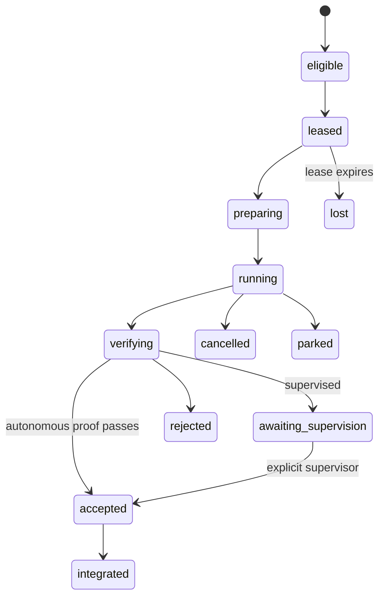

# TaskMesh contracts and runtime model

TaskMesh joins its rebuildable runtime overlay to the canonical Task-Spec graph
by `task_revision_digest`. The SQLite database can be deleted and rebuilt from
Task-Spec, Git, acceptance records, and durable TaskMesh events; it cannot grant
write authority.

## Authority split

| Surface | Canonical owner | Mutable by TaskMesh |
|---|---|---|
| Task body, write scope, budgets, dependencies | Task-Spec Markdown | No |
| Task revision and HMAC authorization | Task-Spec gate | No |
| Ready frontier and conflict groups | Derived `TaskGraphView/v1` | No |
| Run, route, lease, attempt, event, workspace | TaskMesh overlay | Yes |
| Acceptance result and acceptance record | `taskspec accept` | Only through the canonical command |
| Run integration branch | TaskMesh | Yes |
| User target branch | Human/Git workflow | No |

## Versioned objects

| Contract | Required identity |
|---|---|
| `TaskMeshAPI/v1alpha1` | exact Task-Spec product version plus API capability negotiation |
| `TaskMeshRun/v1` | run ID, pinned target commit, target and integration branches, mode |
| `ExecutorCapability/v1` | adapter, harness, observed version, tools, assurance modes, availability |
| `DispatchDecision/v1` | every candidate, rejection reason, policy digest, optional advisor digest, selection |
| `RunLease/v1` | task revision, attempt UUID, fencing token, owner, issue/expiry/heartbeat times |
| `TaskMeshEvent/v1` | monotonically ordered repository event with run and optional attempt identity |
| `TaskMeshView/v1` | rebuildable cockpit projection over runs, attempts, leases, routes, and events |
| `SandboxEvidence/v1` | attempt-bound projection of the host `EnvironmentAttestation/v1` |
| `CredentialLease/v1` | provider/model/scopes and expiry metadata; never the capability secret |
| `TaskMeshRoster/v1` | optional repo file of effort-band adapter/model candidates; never credentials |

TaskMesh reuses `TaskGraphView/v1`, `TaskHandoff/v3`, receipt v2 contracts,
`AcceptanceRecord/v1`, `AcceptanceFailure/v1`, and
`EnvironmentAttestation/v1` rather than introducing parallel authority types.

## State machine

Only one fencing token remains authoritative for a task revision. Expiry or
resume creates a new attempt; a late worker cannot submit against the new
fence. TaskMesh claims authoritative-attempt fencing, not exactly-once external
model execution.

## CLI surface

| Intent | Command |
|---|---|
| Prepare or diagnose | `taskspec mesh init`, `taskspec mesh doctor` |
| Inspect eligibility | `taskspec mesh frontier`, `taskspec mesh explain --task <id>` |
| Start work | `taskspec mesh run --task <id> …`, `taskspec mesh run --frontier …` |
| Observe | `taskspec mesh status`, `taskspec mesh watch <run>` |
| Control | `taskspec mesh cancel`, `resume`, `accept`, `finish` |
| Inspect adapters | `taskspec mesh adapters list`, `taskspec mesh adapters probe` |
| Prepare isolation | `taskspec mesh setup sandbox` |
| Connect a cockpit | `taskspec mesh mcp` |

Mutations support global `--dry-run`; structured callers use global `--json`.
Usage failures exit 2, unavailable runtime/configuration exits 3, and a runtime
policy or execution rejection exits 1.

## Stable runtime failures

`SANDBOX_UNAVAILABLE`, `CREDENTIAL_BOUNDARY_UNVERIFIED`,
`NO_ELIGIBLE_EXECUTOR`, `LEASE_CONFLICT`, `ATTEMPT_STALE`,
`EXECUTION_FAILED`, `ACCEPTANCE_FAILED`, `INTEGRATION_CONFLICT`, and
`TARGET_DIVERGED` are machine-readable failure codes. Human output always
provides the same code and one safe next action when recovery is possible.
